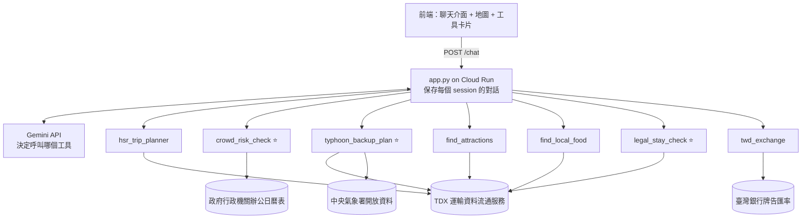

# Taiwan Like a Local：專案工作規劃

> 給外國同學的台灣旅遊 copilot。像一位台灣朋友一樣，幫你排交通、找景點和美食、避開連假人潮與颱風、確認住的地方合法，順便算好台幣預算。

- 課程：Agentic AI（Columbia, Fall 2026）
- 組員：3 人（成員 A / B / C，待認領）
- 作業要求：用 `gemini-web-tool-calling` starter 做一個會呼叫工具的聊天 agent，部署到 Google Cloud Run

---

## 1. 專案概述

**一句話：** 外國旅客規劃台灣行程時，最常踩的雷是「遇到連假買不到車票」和「遇到颱風行程泡湯」。一般旅遊網站不會提醒這些事，我們的 agent 會。

**差異化（Originality）：** 我們不只做「查景點、查天氣」，而是把**台灣在地人的經驗**變成工具：

- 國定假日 → **人潮風險警報**（國慶、春節連假高鐵一票難求）
- 天氣 → **颱風備案**（壞天氣自動換成室內景點）
- 住宿 → **合法旅宿檢查**（台灣有不少未登記民宿，出事沒有保障）

---

## 2. 目標使用者與使用情境

**目標使用者：** 想去台灣玩、看不太懂中文的外國同學（助教多半就是這類使用者）。

| 情境 | 使用者會問 | Agent 會做 |
|---|---|---|
| 排行程 | Plan 2 days in Taipei and 1 day in Tainan by train. | 查景點、美食、高鐵班次，排出行程 |
| 挑日期 | Is Oct 10 a bad day to travel? | 查國定假日，提醒國慶連假人潮 |
| 天氣變化 | A typhoon is coming, what should I do in Tainan? | 查颱風警報，改推室內景點 |
| 找住宿 | Is this B&B in Hualien legal? | 查觀光署登記資料 |
| 算預算 | I have $1,500, is that enough for a week? | 查台銀匯率換算台幣 |

---

## 3. 作業要求對照

| 作業要求 | 我們怎麼達成 |
|---|---|
| 記住整個 session 的對話 | 沿用 starter 的 `session_id`，每個 session 分開儲存 |
| 至少三個工具 | 共 7 個工具 |
| 至少一個工具取外部資料 | 7 個工具都接外部資料 |
| 一人一個原創工具 | 3 個原創工具：`crowd_risk_check`、`typhoon_backup_plan`、`legal_stay_check` |
| 工具命名清楚、錯誤處理有用 | 每個工具錯誤時回傳 `error` + `hint`（見第 6 節） |
| 保留 `/chat` 回傳格式 | `response`、`session_id`、`tool_calls`（含 `name`、`args`、`result`） |
| 前端跟 starter 不同 | 地圖＋行程時間軸＋工具呼叫卡片（見第 8 節） |
| README 與三個範例查詢 | 見第 11 節 |

---

## 4. 系統架構



⭐ = 原創工具（一人負責一個）

**流程：** 使用者發問 → `app.py` 把對話交給 Gemini → Gemini 決定要呼叫哪些工具 → `app.py` 執行工具、把結果送回 Gemini → Gemini 整理成回答 → 連同 `tool_calls` 回傳前端。

---

## 5. 外部資料來源與金鑰

| 資料來源 | 用在哪些工具 | 金鑰 | 備註 |
|---|---|---|---|
| [TDX 運輸資料流通服務](https://tdx.transportdata.tw/) | 交通、天氣備案、景點、美食、住宿 | 免費註冊，拿 Client ID / Secret 換 token | **一組帳號包辦 5 個工具**；有呼叫次數限制，要做快取 |
| [中央氣象署開放資料](https://opendata.cwa.gov.tw/) | 天氣 | 免費註冊拿 API key | |
| [政府行政機關辦公日曆表](https://data.gov.tw/dataset/14718) | 國定假日 | 不用 | 每年公布一次，可以啟動時下載快取 |
| [臺灣銀行牌告匯率](https://rate.bot.com.tw/xrt?Lang=zh-TW) | 匯率 | 不用 | 官網提供 CSV 下載 |
| Gemini API | 對話與工具呼叫 | 需要 | starter 已內建 |

**金鑰管理：** 所有 key 都設成 Cloud Run 的環境變數，**絕對不要 commit 進 repo**。

---

## 6. 工具規格

**共同規則：**

- 所有工具都回傳 JSON。
- 出錯時不丟 exception，回傳 `{"error": "發生什麼事", "hint": "模型下一步該怎麼做"}`。
- 對外呼叫都設 timeout（建議 10 秒）。
- 城市名稱統一接受英文（`Taipei`、`Tainan`…），工具內部轉成 TDX 的城市代碼。

> ⚠️ 下面標「開工前確認」的 API 路徑與資料集代碼，第 1 週要實際呼叫一次驗證。

### 6.1 交通：`hsr_trip_planner`

查高鐵或台鐵的班次、車程和票價。

| 欄位 | 內容 |
|---|---|
| Input | `origin`（起站，英文或中文）、`destination`（迄站）、`date`（YYYY-MM-DD）、`depart_after`（HH:MM，選填）、`rail`（`THSR` 或 `TRA`，預設 `THSR`） |
| 外部呼叫 | TDX 高鐵：起訖站每日時刻表、起訖站票價；TDX 台鐵：同類 API（開工前確認版本與路徑） |
| Output | 最多 3 個班次：`train_no`、`departure`、`arrival`、`duration_min`、`fare_twd` |
| 錯誤處理 | 站名找不到 → 回傳可用站名清單；日期超出時刻表公布範圍 → 提示改查較近的日期；當天沒有班次 → 建議改搭台鐵或換時段 |

### 6.2 國定假日：`crowd_risk_check` ⭐ 原創

判斷某段日期是不是連假、補班，給出人潮風險等級。

| 欄位 | 內容 |
|---|---|
| Input | `start_date`、`end_date`（YYYY-MM-DD，最多 30 天） |
| 外部呼叫 | 政府行政機關辦公日曆表（CSV / JSON） |
| 判斷規則（原創邏輯） | 連續放假 3 天以上 → 高；連假前一天、收假當天 → 交通高；一般週末 → 中；平日 → 低；補班日 → 註明 |
| Output | 每天一筆：`date`、`weekday`、`is_holiday`、`holiday_name`、`risk`（low / medium / high）、`reason`，例如「國慶連假第 1 天，高鐵自由座會很擠」 |
| 錯誤處理 | 範圍超過 30 天 → 請模型縮小範圍；該年度日曆尚未公布 → 說明只能判斷週末，並提示使用者 |

### 6.3 天氣：`typhoon_backup_plan` ⭐ 原創

查天氣和颱風警報，天氣不好就自動推薦室內備案景點。

| 欄位 | 內容 |
|---|---|
| Input | `city`、`date` |
| 外部呼叫 | 中央氣象署：縣市天氣預報、颱風警報（資料集代碼開工前確認）；TDX 觀光景點（篩選室內類別，例如博物館、文化館） |
| 判斷規則（原創邏輯） | 有颱風警報，或降雨機率 ≥ 70% → 判定為壞天氣，附 3 個室內景點 |
| Output | `forecast`（天氣、溫度、降雨機率）、`typhoon_alert`（有 / 無與內容）、`is_bad_weather`、`backup_spots`（最多 3 個） |
| 錯誤處理 | 日期超出預報範圍（約一週）→ 說明只能提供該季節的一般提醒；城市名稱錯誤 → 回傳可用城市清單 |

### 6.4 景點：`find_attractions`

依城市和類型找景點。

| 欄位 | 內容 |
|---|---|
| Input | `city`、`keyword`（選填，例如 temple、hiking、museum）、`limit`（預設 5） |
| 外部呼叫 | TDX 觀光景點 API |
| Output | `name`、`description`（截短）、`open_time`、`address`、`lat`、`lon`、`ticket_info` |
| 錯誤處理 | 查無結果 → 建議放寬關鍵字或換鄰近城市 |

### 6.5 美食：`find_local_food`

依城市找餐廳與夜市。

| 欄位 | 內容 |
|---|---|
| Input | `city`、`keyword`（選填，例如 night market、beef noodle、vegetarian）、`limit`（預設 5） |
| 外部呼叫 | TDX 觀光餐飲 API |
| Output | `name`、`description`、`address`、`open_time`、`lat`、`lon` |
| 錯誤處理 | 查無結果 → 建議換關鍵字；TDX 資料多為中文 → 由 Gemini 翻譯說明 |

### 6.6 住宿：`legal_stay_check` ⭐ 原創

找合法登記的旅館與民宿，或檢查某間住宿有沒有合法登記。

| 欄位 | 內容 |
|---|---|
| Input | `city`、`name`（選填，要檢查的住宿名稱）、`type`（選填：`hotel` / `bnb`） |
| 外部呼叫 | TDX 觀光旅宿 API（觀光署登記的旅館、民宿資料） |
| 判斷規則（原創邏輯） | 有 `name` → 模糊比對名稱，回傳是否有登記；沒有 `name` → 回傳該城市合法住宿清單 |
| Output | 檢查模式：`is_registered`、`matched_name`、`license_type`、`address`、`phone`；清單模式：最多 5 筆住宿 |
| 錯誤處理 | 查無登記 → 回答「查無登記資料，不一定代表違法，可能名稱不同，建議向業者索取登記證號」 |
| 限制 | **沒有房價與空房資訊**（沒有免費 API），只負責推薦合法住宿，訂房請使用者到訂房網站 |

### 6.7 匯率：`twd_exchange`

美金換台幣，並比較今天與近 30 天平均。

| 欄位 | 內容 |
|---|---|
| Input | `amount`、`currency`（預設 `USD`）、`direction`（`to_twd` 或 `from_twd`） |
| 外部呼叫 | 臺灣銀行牌告匯率 CSV（當日與歷史，URL 開工前確認） |
| Output | `cash_rate`、`spot_rate`、`avg_30d`、`diff_percent`、`converted_amount` |
| 錯誤處理 | 不支援的幣別 → 回傳台銀支援的幣別清單；台銀網站連不上 → 提示使用者到台銀官網查詢 |
| 注意 | 只提供數據，不做投資建議 |

---

## 7. Agent 行為與 System Prompt 原則

1. **角色：** 你是一位熱心的台灣在地朋友，用英文（或使用者的語言）回答外國旅客。
2. **排行程時一定先呼叫 `crowd_risk_check`**，連假日子要主動提醒。
3. **旅遊日期在一週內時，呼叫 `typhoon_backup_plan`** 檢查天氣。
4. **推薦住宿一律用 `legal_stay_check`**，不要推薦查不到登記的住宿。
5. **金額換算一律交給 `twd_exchange`**，不要自己心算。
6. 資訊不足（例如沒說日期、城市）時先問使用者，不要亂猜。
7. 工具回傳 `error` 時照 `hint` 處理，不假裝查到資料。
8. 回答附上來源（例如「資料來源：TDX、中央氣象署」）。

**範例流程：**

> 使用者：I'm visiting Taiwan Oct 8–14 with $1,500. Plan Taipei and Tainan for me.

1. `crowd_risk_check(2026-10-08, 2026-10-14)` → 發現 10/10 國慶連假，建議避開當天搭高鐵
2. `hsr_trip_planner(Taipei, Tainan, 2026-10-12)` → 查班次和票價
3. `typhoon_backup_plan(Tainan, 2026-10-12)` → 檢查天氣，需要時準備室內備案
4. `find_attractions(Tainan)`、`find_local_food(Tainan, "night market")` → 排景點和美食
5. `legal_stay_check(Tainan, type="bnb")` → 推薦合法民宿
6. `twd_exchange(1500, USD, to_twd)` → 換算預算
7. 使用者追問「那改成 10/9 出發呢？」→ agent 記得前面的行程，只重算有變動的部分（**展示 session 記憶**）

---

## 8. 前端設計

- **頂部：** 專案名稱＋一句說明：「Your local friend for traveling Taiwan」
- **左欄聊天：** 空白時顯示 3 個可點的範例問題（就是 README 的三個查詢）
- **工具呼叫卡片：** 每次工具呼叫顯示一張可展開的卡片（工具名稱、參數、結果），不同工具不同圖示
- **右欄視覺化：**
  - **台灣地圖**：景點、餐廳、住宿用不同顏色的圖釘標出來（用工具回傳的經緯度，可用 Leaflet + OpenStreetMap）
  - **日期列**：旅遊期間每天一格，連假標紅、颱風標警示
  - **預算卡**：美金與台幣對照
- **手機版：** 右欄收到聊天上方，可折疊

右欄全部直接讀 `tool_calls` 的 `result` 來畫，後端不需要額外 API。

---

## 9. 分工

| 成員 | 原創工具 | 其他工具 | 共用工作 |
|---|---|---|---|
| 成員 A | `crowd_risk_check`（國定假日） | `hsr_trip_planner`（交通） | **TDX 取 token 共用模組**（最優先）、system prompt、`app.py` 整合 |
| 成員 B | `typhoon_backup_plan`（天氣） | `find_attractions`（景點） | Cloud Run 部署、GitHub 連續部署、API key 管理 |
| 成員 C | `legal_stay_check`（住宿） | `find_local_food`（美食）、`twd_exchange`（匯率） | 前端（聊天、工具卡片、地圖、日期列） |
| 全員 | — | — | README、實測範例查詢、互相 code review（每個人都要看得懂其他人的程式） |

**建議的 repo 結構：**

```
.
├── app.py                 # 只負責路由、session、註冊工具
├── tools/
│   ├── tdx_client.py      # 成員 A：TDX token 與共用請求
│   ├── transport.py       # 成員 A：hsr_trip_planner
│   ├── holidays.py        # 成員 A：crowd_risk_check
│   ├── weather.py         # 成員 B：typhoon_backup_plan
│   ├── attractions.py     # 成員 B：find_attractions
│   ├── food.py            # 成員 C：find_local_food
│   ├── lodging.py         # 成員 C：legal_stay_check
│   └── exchange.py        # 成員 C：twd_exchange
├── static/                # 成員 C：前端
├── tests/                 # 每人各自的工具測試
├── pyproject.toml
├── uv.lock
├── README.md
└── submission.json
```

**協作方式：**

- 每個工具一個檔案，`app.py` 只負責匯入與註冊，減少 merge 衝突。
- 第 1 週先把每個工具的函式簽名和回傳格式定好，前端可以先用假資料開發。
- 每人開自己的 branch，透過 PR 合併到 `main`；`main` 一更新就自動部署到 Cloud Run。

---

## 10. 時程（三週，實際日期待確認繳交期限）

### 第 1 週：申請帳號、定規格、架骨架

- [ ] **全員**：申請 TDX 帳號、中央氣象署 API key、Gemini API key（TDX 審核可能要時間，**第一天就申請**）
- [ ] 解開 starter，本機跑起來
- [ ] 每個工具的 API 實際呼叫一次，確認路徑與回傳格式（第 6 節標「開工前確認」的部分）
- [ ] 定案 7 個工具的函式簽名與回傳格式
- [ ] 成員 A：完成 `tdx_client.py`
- [ ] 成員 B：建 GitHub repo、設定 Cloud Run 連續部署、加入助教為 collaborator

**關卡：** 規格定案，全員同意。

### 第 2 週：各自完成工具與前端

- [ ] 每人完成自己負責的工具
- [ ] 每個工具都有測試：正常情況＋至少 2 種錯誤情況
- [ ] 成員 C：前端先用假資料完成聊天、卡片、地圖
- [ ] 成員 A：寫好 system prompt 初版

**關卡：** 7 個工具測試全部通過。

### 第 3 週：整合、部署、交付

- [ ] 所有工具接上 Gemini
- [ ] 實測 3 個範例查詢，調整 system prompt 與工具說明
- [ ] 測試 session 記憶與 session 分離
- [ ] 完成 README 與 `submission.json`
- [ ] 確認部署網址用瀏覽器能直接打開

**關卡：** 繳交。

---

## 11. README 範例查詢

| # | 範例查詢 | 預期呼叫的工具 | 正確回答要包含 |
|---|---|---|---|
| 1 | I'm visiting Taiwan Oct 8–14 with $1,500. Plan 2 days in Taipei and 1 day in Tainan by high-speed rail. | `crowd_risk_check`、`hsr_trip_planner`、`find_attractions`、`find_local_food`、`twd_exchange` | 國慶連假提醒、高鐵班次與票價、景點與美食、台幣預算 |
| 2 | A typhoon might hit next week. What can I do in Taipei if it rains? | `typhoon_backup_plan`、`find_attractions` | 天氣預報或颱風警報、3 個室內景點 |
| 3 | I found a cheap B&B in Hualien called "XXX". Is it legal? Can you suggest some registered ones? | `legal_stay_check` | 是否查得到登記、合法民宿清單、提醒索取登記證號 |

---

## 12. 驗收清單

- [ ] 部署網址用瀏覽器打得開，不需要登入
- [ ] 3 個範例查詢都呼叫了預期的工具，回答正確
- [ ] 同一個 session 追問時，agent 記得前面的內容
- [ ] 開兩個瀏覽器分頁，對話不會互相影響
- [ ] 故意輸入錯誤的站名、日期時，agent 會問回使用者而不是崩潰
- [ ] `/chat` 回傳 `response`、`session_id`、`tool_calls`
- [ ] repo 根目錄有 `app.py`、`pyproject.toml`、`uv.lock`、`README.md`、`submission.json`
- [ ] `submission.json` 列出三位組員的 UNI
- [ ] 已加入助教為 collaborator：`codeboi07`、`bhuvighosh3`、`nniishhh`、`x`
- [ ] 沒有任何 API key 被 commit 進 repo

**評分對照：**

| 評分項目 | 配分 | 我們的得分點 |
|---|---|---|
| Basics | 1 | README、submission.json |
| Functionality | 11 | 3 個範例查詢實測、session 分離、錯誤處理 |
| Tools | 8 | 7 個工具都接外部資料、每個都有 hint 式錯誤處理 |
| Creativity | 5 | 3 個原創工具（連假人潮、颱風備案、合法旅宿）、地圖前端 |

---

## 13. 風險與對策

| 風險 | 影響 | 對策 |
|---|---|---|
| TDX 帳號審核慢 | 5 個工具卡住 | 第一天就申請；等待期間先用存下來的範例 JSON 開發 |
| TDX 呼叫次數限制 | Demo 時工具失敗 | 景點、美食、住宿資料變動少，啟動時快取或存成本地檔案 |
| 7 個工具太多，模型選錯工具 | 回答品質下降 | 工具說明寫清楚「什麼時候用」；時間不夠就把景點和美食合併成 `find_places(type=...)` |
| 氣象預報只有約一週 | 遠期行程查不到天氣 | 工具說明限制，回傳季節性提醒（例如 7–10 月是颱風季） |
| TDX 資料多為中文 | 外國使用者看不懂 | 讓 Gemini 在回答時翻譯；工具回傳保留原文名稱方便問路 |
| 住宿沒有房價與空房 | 使用者期待落差 | 前端與回答都明確說明，只負責「合法推薦」 |
| 台銀 CSV 格式改變 | 匯率工具失敗 | 解析失敗時回傳 hint，請使用者看台銀官網 |

---

## 14. 待決事項

- [ ] 確認繳交期限，把時程改成實際日期
- [ ] 三位組員認領成員 A / B / C
- [ ] 確認 starter zip 的架構（工具怎麼宣告、session 怎麼存）
- [ ] 決定要不要把景點和美食合併成一個工具
- [ ] 決定前端地圖要用哪個套件（建議 Leaflet，免費不用 key）

---

## 15. 參考資料

- [TDX 運輸資料流通服務](https://tdx.transportdata.tw/)
- [TDX 觀光資訊資料庫開放資料 V2（Swagger）](https://tdx.transportdata.tw/api-service/swagger/tourism/0aed433a-9e95-404d-974c-4e70e29ae460)
- [TDX API 介接教學全攻略（HackMD）](https://hackmd.io/@hexschool/H1VfZLW4F)
- [TDX 運輸資料介接指南](https://bookdown.org/chiajungyeh/TDX_Guide/)
- [中央氣象署開放資料平臺](https://opendata.cwa.gov.tw/)
- [政府行政機關辦公日曆表（政府資料開放平臺）](https://data.gov.tw/dataset/14718)
- [臺灣銀行牌告匯率](https://rate.bot.com.tw/xrt?Lang=zh-TW)
- [爬取臺灣銀行牌告匯率 - Python 教學](https://steam.oxxostudio.tw/category/python/spider/exchange.html)
