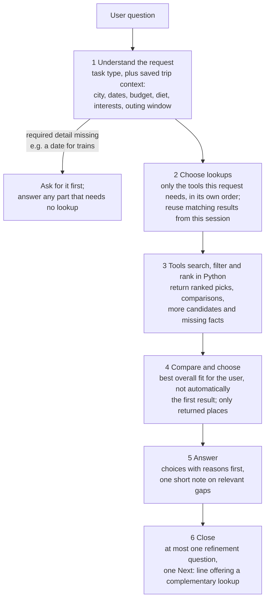
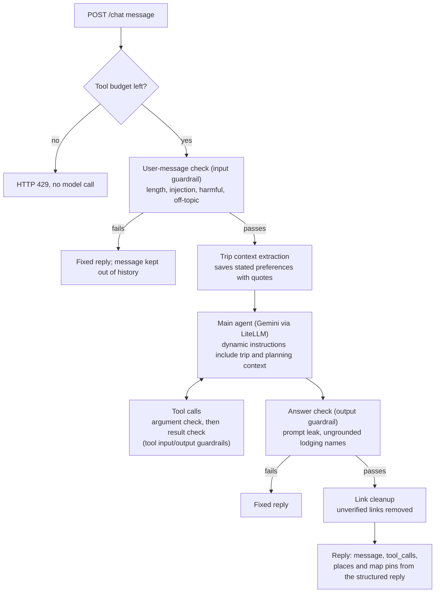
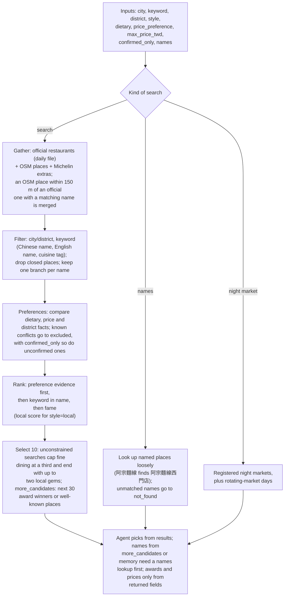
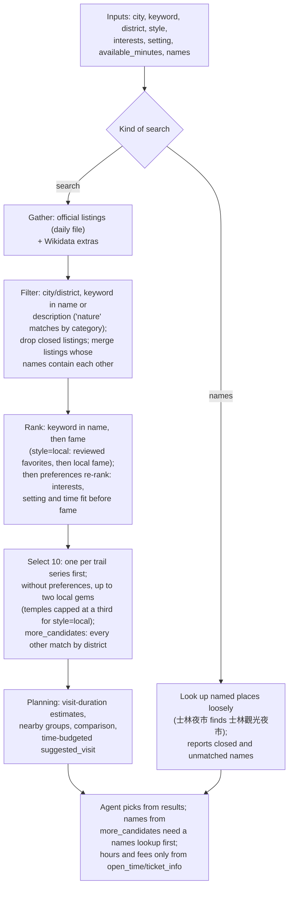

# Design notes

How [Taiwan Like a Local](../README.md) works: the agent's decision flow, each tool, the data
behind them, and how to run, test and deploy it. The README is the short version; this file is
the reference for contributors.

1. [Who needs what](#who-needs-what)
2. [Agent workflow](#agent-workflow)
3. [Agent design](#agent-design)
4. [Tools](#tools)
5. [Frontend](#frontend)
6. [Guardrails and limits](#guardrails-and-limits)
7. [Data](#data)
8. [Run locally and test](#run-locally-and-test)
9. [Deploy and access](#deploy-and-access)
10. [Project layout](#project-layout)

## Who needs what

| You want to | You need |
|---|---|
| Use the live app (browser or API) | A Google account that the team has authorized for the service ([Deploy and access](#deploy-and-access)). No API keys: the service holds its own. |
| Run your own copy | Your own TDX client ID/secret, CWA API key, and a GCP project with billing and the Vertex AI API enabled ([Run locally](#run-locally-and-test)) |
| Run the tests | Nothing: network and model calls are mocked |

Without Vertex AI there is no chat at all. Without TDX credentials, stays and trains fail;
sights and food still work from the daily open-data files. Without a CWA key, weather fails.

## Agent workflow

### Decision flow

How the agent turns a travel question into an answer. The rules come from
[prompts/system.txt](../prompts/system.txt); details are in [Agent design](#agent-design).



Typical combinations: a focused request uses one tool; a whole trip may combine a base
(stays), sights, food, transport, weather and crowds; a dated outing checks weather and, if
rain is likely, searches indoor sights separately.

### Request pipeline

What happens to one `/chat` message in the code ([app.py](../app.py),
[guardrails.py](../guardrails.py)):



At most 8 model turns per message. A turn has a 180-second deadline. Rejected or failed turns
roll back preference and choice changes.

## Agent design

### Conversation policy

Broad recommendation requests get a small initial selection from tool results, with areas and
brief reasons, followed by at most one optional question to refine the next answer. The agent
reuses details from the same conversation and respects corrections or requests to skip questions.
It asks first when required lookup information is missing, such as the date for train schedules.
District filtering narrows an area; it does not confirm walking distance or travel time.

Completed answers end with one **Next:** line offering the most useful complementary lookup the
user has not covered, with a ready-to-type example (food → stays nearby; trains → crowds and
weather for that date; an itinerary → weather, trains, crowds). It is skipped when the agent is
asking for missing details or the user asked for no questions.

The answer format follows the task: a comparison or a few suggestions need not become an
itinerary just because a time budget is known. Tool rankings and estimated outings support
the agent's decision; it may choose a different returned option for better overall trip fit.
Optional questions should resolve a useful gap, rather than appear as a standard ending.
Rough budgets can use labeled assumptions, while returned prices remain distinct from estimates.

For transport beyond the rail tool's coverage, the agent may give general route advice with
estimated costs/durations. Exact last departures, current fares, and all-night service need
relevant retrieved information. Source lines name sources from relevant tool results, including
reused session results; general knowledge is not presented as an official lookup.

This is everyday travel planning: useful suggestions and reasonable estimates take priority
over exhaustive verification. Traveler-facing answers start with choices and concrete
comparisons. Evidence/status labels stay internal; relevant data gaps are combined into one
short practical note after suggestions. Missing fields alone do not trigger a refusal. Strict
evidence filtering requires an explicit request for confirmed matches. This policy applies to
every recommendation tool.

### Structured final replies

The main agent uses SDK `output_type=TravelReply` from `agent_reply.py`: Markdown
`message`, proposed `places`, and lookup `sources`. Accepted planning records and their
candidates carry stable reference IDs. The server resolves IDs within the current session,
ignores unknown references and places whose displayed labels are absent from the answer,
and renders source footers from referenced result metadata. General advice uses no sources.
Internal IDs are removed from displayed prose and labels, preserving human-readable names,
ordinary links, and map references. Session history and proposals keep the cleaned text.
References identify returned records; they do not independently verify every sentence.

Proposals save explicit recommended/alternative places and their districts alongside a
bounded text excerpt. These suggestions remain separate from user-confirmed choices.
Attraction/food map pins use referenced original listing names, so English-only answers
and follow-ups reusing earlier results can show pins without another lookup.
The frontend receives readable `response`, actual `tool_calls`, and `map_pins`;
JSON replies stay internal. Guardrails inspect the message, helper agents read its text,
and history keeps cleaned structured replies. Rejected/failed turns clear reply metadata
and roll back choices and proposals. Provider failures retain accepted completed lookups;
guardrail rejections restore the previous planning state. No additional model call is added.

### Trip context within a session

Each session saves the user's city, area, travel dates, departure point, budget, interests,
dietary needs, outing duration/setting and clock window, and question preference separately
from the last 20 user turns. `trip_context.py` extracts changes using a typed SDK output and
`prompts/trip_context.txt`; each saved value includes an exact supporting quote from the
current user message. Missing details, explicit "no preference", and withdrawn details are
distinct. Latest corrections replace old values; changing city/date clears the old outing
window; changing city also clears the area. Clock corrections reconcile the duration, and
duration corrections derive a matching boundary. Derived values are marked; saved windows are
restored only for the matching city/date. Unrelated preferences remain.
Budget values retain the stated currency and scope; extraction does not convert prices.

The blocking input guardrail screens the message before extraction, then the main agent's
dynamic instructions include the updated context. This adds one model call per accepted
message, with a 10-second extraction timeout. Invalid output or extraction failure retains
the previous context and lets the conversation continue. Provider HTTP 429 stops the turn
early with a busy/rate-limit message; it does not continue into more model calls.
Failed/rejected main runs roll back preference changes. Evidence checks validate provenance
and format; semantic extraction still depends on the model. Requests within one session run in
order to avoid overlapping updates.

Context is isolated by `session_id`, survives history trimming, and is removed by **New trip**,
session eviction, six hours of inactivity, or server restart. It is not a permanent user profile.
The browser restores its bounded transcript and board after refresh while the server session is
active, and explicitly reports an expired session. Sends are serialized; New trip cancels the
active server turn before removing its state. Busy states are never evicted. Classifier/extractor
calls have ten-second deadlines, the whole turn has a 180-second deadline, and the frontend
request stops after 190 seconds.

### Planning context and SDK hooks

`agent_hooks.py` collects accepted tool results after output checks. `planning_context.py`
keeps up to 10 compact lookup records: candidate locations, reference prices, weather strategy,
train times, and suggested outing durations/timelines. Dynamic instructions expose relevant
city records before the next main-agent call, including follow-ups after history trimming.
The injected planning summary is capped at 9,000 characters. The active city's records are
prioritized, with other destinations retained when space permits so a side trip does not
hide the trip's accommodation base. This remains bounded conversation memory, not a complete
stored itinerary. Helper agents receive the beginning and end of long replies, preserving
the latest follow-up question.

Tool-ranked picks, bounded assistant proposal excerpts, and user-confirmed choices are distinct.
The extractor can save explicitly named selections with user evidence; vague agreement
does not select an alternative. Extraction still depends on the model's interpretation.
Planning facts do not become user preferences. Rejected turns roll back planning updates;
provider failures, timeouts, and tool-round exhaustion retain accepted completed lookups, while
rolling back preferences, named choices, and unfinished proposals. Partial responses expose
those real lookups even without a final model answer. There are no extra model calls.
Lookup keys include all executed criteria; candidate identities are independent of lookup order.
Selected/proposed evidence survives ordinary lookup eviction in a bounded archive (80 compact
records), while the injected summary remains capped at 9,000 characters.

Each turn also saves a bounded diagnostic entry (last 20 turns) and writes
`Agent planning diagnostics` to the server log: main-agent model-call count, tool counts,
recommended-place counts by kind, failed lookups, elapsed time, and flags for missing
sightseeing/food results in broad plans, identical repeated lookups, or food searches without
an available planning area. Recommendation counts have no fixed daily threshold; slower visits
and travel days can need fewer stops. Logs omit chat text, arguments, and result contents.
Flags are review signals, not proof an answer is bad; hooks do not force tool choices or
rewrite answers. `/chat` keeps its response format.

### SDK tool definitions

The main agent uses `gemini-3.5-flash-lite` on Vertex AI with medium thinking, configured
through `ModelSettings.reasoning` in `app.py`. The input classifier and preference
extractor explicitly use minimal thinking to keep their preprocessing calls fast.

All seven agent tools are typed `@function_tool` wrappers in `tools/agent_tools.py`.
The SDK generates descriptions and JSON schemas from their type hints and Google-style
docstrings. `Literal` defines choices; `Annotated`/Pydantic `Field` defines numeric bounds.
The plain Python functions and `run_tool` registry remain usable by tests and scripts;
there are no handwritten `SCHEMA` dictionaries.

The shared adapter executes synchronous work in a worker thread, restores saved outing
arguments, applies explicit lodging counts, and records the actual arguments/results for
the chat display. Input/output tool guardrails still run. SDK argument errors
produce recorded `error`/`hint` replies so the agent can correct a call and continue.
Optional arguments retain defaults with `strict_mode=False` for Gemini; supplied values
are validated before execution, and unknown arguments are rejected. Conversation policy
and the choice to combine weather/attraction tools remain in the system prompt.

Tool descriptions explain when to combine searches. The SDK adapter adds conditional
`next_steps` suggestions for broad trip plans and dated single-day outings lacking matching
weather. These hints do not execute tools or save preferences; the model chooses actual calls,
which remain visible separately. Same-turn attempts suppress repeated suggestions, and matching
weather from earlier turns can be reused. The lightweight trip-plan detector is heuristic.

To add a tool, register its domain function in `tools/__init__.py`, add a decorated typed
wrapper to `build_tools`, describe arguments in its docstring, and extend the mocked tests.
Check a fresh app session after description changes ([manual checks](#manual-checks)).

## Tools

| Tool | What it does | Data source |
|---|---|---|
| `legal_stay_check` ⭐ | Checks registration, or recommends registered stays by district, type and reported starting rates | Tourism Administration lodging register via [TDX](https://tdx.transportdata.tw/) |
| `find_local_food` | Restaurants by dish, diet and price, ranked by preference evidence, then awards/local score; night markets; `style: local` | Tourism Administration [daily open data](https://data.gov.tw/dataset/7779) (TDX as fallback), [OpenStreetMap](https://www.openstreetmap.org/copyright), award lists, local night-market schedules |
| `find_attractions` | Sights by interests, indoor/outdoor setting and available time, with a ranked pick, alternatives and a suggested outing; `style: local` | Tourism Administration [daily open data](https://data.gov.tw/dataset/7777) (TDX as fallback), plus [Wikidata](https://www.wikidata.org/) and Wikipedia pageviews for fame and missing sights |
| `hsr_trip_planner` | THSR or TRA options ranked by time/fare preferences; default three, up to ten | TDX rail timetables and adult one-way standard-class fares |
| `typhoon_backup_plan` ⭐ | Compares forecast periods for the outing window and recommends outdoor, flexible or indoor plans | [CWA open data](https://opendata.cwa.gov.tw/) (`F-D0047-091`, `W-C0034-001`) |
| `crowd_risk_check` ⭐ | Official days off and travel-pressure estimates for trips up to 30 days | [Government office calendar](https://data.gov.tw/dataset/14718) and [historical TRA station entries](https://data.gov.tw/dataset/8792) |
| `twd_exchange` | Converts to/from TWD and compares weekly samples over four weeks | [fawazahmed0/exchange-api](https://github.com/fawazahmed0/exchange-api) daily rates |

⭐ = original tool. Every tool returns `{"error", "hint"}` on failure so the model knows what to do next.

**Shared result rules.** Treat missing facts as **unknown**, explicit contrary reports as
**conflicts**, and failed lookups as **unavailable**. Source claims are **reported**, not
independently verified. Compare only available facts, explain the best supported fit and
alternatives, and name relevant uncertainty. Food, attractions, lodging, rail and weather
return explicit comparison fields; the other tools return their domain outputs.

### Food (`find_local_food`)



**Scores** (from [scripts/build_food_fame.py](../scripts/build_food_fame.py)):

- **Fame** is the strongest signal: Michelin 3 stars 1.0, 2 stars 0.95, 1 star 0.9, Bib
  Gourmand 0.75, Selected 0.6; 500盤 or 500碗 by plates or bowls on a log scale; 0.7 for a
  reviewed well-known place without awards; 0.2 for an English name in OSM and no award.
- **Local** is max(500盤, 500碗) × (1 − Michelin score); chains (a name on 5+ OSM places) get
  0.3 of it. Awards last listed in 2024 count 0.7, earlier ones 0.5.
- **Fine dining** means a Michelin star, a $$$ price or higher, or a 500盤 place that neither
  500碗 nor a Michelin $–$$ price marks as everyday food. Unless the user asks for fine dining
  (Michelin, omakase, tasting menu…), it fills at most a third of the results.
- A manual closed list (for example RAW) removes places the data still lists.

**Preferences.** Optional arguments `dietary` (`vegetarian`/`vegan`), `price_preference`
(`budget`/`mid_range`/`any`), `max_price_twd`, and `confirmed_only` accompany city/district/dish
filters. Keep them on `names` lookups. Set `confirmed_only: true` when the user requests only
confirmed matches; this requires reported support for every requested criterion, not live
independent verification. `budget` selects the relative `$` category and `mid_range` allows
`$`/`$$`; unknown bands remain unconfirmed. A numeric cap is explicitly per person per meal in
TWD. No returned band verifies that exact cap; lower known bands simply rank first among
otherwise equal unconfirmed leads.

Each restaurant's `facts` contains `value`, `status`, and `source`, plus dietary evidence when
available. `comparison` checks each requested criterion and marks the overall fit as
`reported_match`, `needs_confirmation`, `conflict`, or `not_requested`. Conflicting options
appear in `excluded`, not `results`. With `confirmed_only`, uncertain candidates are also
excluded without their names; exact meal caps currently cannot be confirmed.
`comparison_summary` counts returned matches/leads, excluded conflicts, and excluded
unconfirmed candidates. Ranking favors dietary reports, then dietary name/cuisine indications,
ahead of candidates with no dietary evidence. It next compares other criteria, dietary variety,
relative prices, and keyword/awards. Ordinary recommendations offer promising dietary leads
with brief caveats when reports or prices are unavailable; "cheap" does not require exact
meal-price confirmation. Constrained searches (district, diet or price) do not inject
lower-fit local gems or cap fine dining. Searches are not exhaustive.

OSM dietary tags retain their [vegetarian](https://wiki.openstreetmap.org/wiki/Key:diet:vegetarian)
and [vegan](https://wiki.openstreetmap.org/wiki/Key:diet:vegan) distinctions. Names/cuisine
terms are only indications; contradictory tags remain uncertain. The OSM builder keeps dietary
tags and reported districts, but the bundled file (built 2026-10-02) predates that, so its
records have no dietary tags and count as unknown until the next rebuild. Merged listings
preserve the source of borrowed hours/dietary information.

**Results.** Each result carries name, English name, awards, `known_for`, relative `price`
band, address, opening hours, `facts`, `missing_fields` and a Google Maps link built from its
coordinates (useful when OSM has no street address). Search results carry no coordinates;
pins come from the final reply ([Frontend](#frontend)).

| Can compare | Missing information / limits |
|---|---|
| Dietary reports, cuisine, district, relative price band, awards, listed hours | No exact current menu prices or ingredient guarantees; some districts are estimated; 57% of OSM places have no street address |

### Attractions (`find_attractions`)



**Scores** (from [scripts/build_fame.py](../scripts/build_fame.py)): fame is the mean of each
listing's county percentiles for Chinese Wikipedia views, article length and language editions,
halved for campuses, stations, airports and science parks; a trail matched to its mountain
scores by the mountain's English Wikipedia views. Local fame is fame × (1 − English fame). 226
local favorites were labeled by Qwen and reviewed by a second model. Local gems are reviewed
favorites or local fame of 0.8 or more.

**Preferences.** Pass `interests` (history, art, nature, hiking, shopping, culture, museums,
temples), `setting` (`indoor`, `outdoor`, or `any`), and `available_minutes` (15–720) when the
user supplies them. The time budget is for the entire outing, excluding travel to/from the
area. Keep these criteria on `names` detail lookups. Preferences rank before fame/local scores;
they do not exclude every unknown or partial match. Broad searches retain fame, variety, and
local-gem behavior.

Each result includes `planning` and `preference_match`; `comparison` provides the recommended
name, reasons, alternatives, and nearby groups. Visit-duration ranges and indoor/outdoor labels
are category/name estimates, separate from reported hours and admission prices. Nearby groups
require every pair to be within 2 km in a straight line. A time-budgeted `suggested_visit` gives
an ordered `timeline` with visits limited by time and suitable candidates, estimated city
transfers (20–60 minutes), and a 30-minute break for outings of at least four hours with
multiple stops. Transfers may connect places beyond the nearby-group radius; unknown
coordinates use a 45-minute allowance without claiming proximity. Visits use typical category
durations rather than automatically expanding to consume the budget. The tool reports planned
and remaining minutes. For a requested itinerary, the agent accounts for remaining time with
suitable options, another search, or explicit free time and breaks; the candidate limit is not
a quota for scheduled stops. Time and setting preferences persist within the session; the
attraction wrapper restores them when omitted on follow-ups. A destination change clears the
old outing's time budget. It is a planning suggestion, not a checked walking route or
date-specific opening-hours itinerary. Missing hours/prices still allow useful recommendations.

| Can compare | Missing information / limits |
|---|---|
| Categories, listed details, interest/setting fit, estimated visit duration, ranked comparison and nearby outing | Planning heuristics are estimates; coordinate distances are not walking routes; hours/fees can be missing |

### Lodging (`legal_stay_check`)

Check mode distinguishes a unique normalized same-city name (`match_status: matched`,
`is_registered: true`) from similar or out-of-city records (`candidates`, null). Candidate
addresses are displayed for disambiguation; an unsuccessful search does not prove illegality.
Check mode keeps its name matching and nationwide fallback behavior.

List mode supports `district` (Traditional Chinese), `type` (`hotel`/`bnb`),
`price_preference` (`budget`/`any`), and `max_price_twd` for a stated numeric nightly budget.
"Cheap" uses `budget`, which ranks by lower reported starting rates without inventing a cap.
The tool makes one cached TDX query for up to 500 candidates, then filters, deduplicates,
and ranks in Python before returning up to `limit` stays (1–10, default 5).
An explicit recommendation count is applied by the SDK wrapper when recognized, even if the
model omits `limit`; guests, nights, star ratings, and prices are not result counts. Numeric
budgets exclude known higher starting rates; absent/zero/invalid rates remain unknown and
eligible. Known lower starting rates rank before missing rates for budget requests;
certification breaks price ties. Without a price preference, Taiwan Host certification leads
the ordering.

`stays` holds the UI/map fields plus `district`, `price_range_twd`, and `preference_match`.
`comparison` provides the recommended name, reasons, reference-price differences, and
candidate counts. A pool reaching 500 may be incomplete; recommendations are among returned
candidates. District matches do not establish proximity to a landmark or MRT. Prices are
owner-reported reference ranges, not booking quotes; a starting rate within a cap does not mean
every room or date qualifies. Missing rates do not prevent useful suggestions.

| Can compare | Missing information / limits |
|---|---|
| Registration, licensed type, district, certification, structured reference rates, ranked pick and trade-offs | Registration is not a quality rating; reference starts do not verify every room or travel date; no live rooms/booking prices |

### Rail (`hsr_trip_planner`)

`hsr_trip_planner` ranks the whole matching timetable before selecting `limit` options (1–10,
default 3). `preference` accepts `earliest_arrival` (default), `fastest`, `cheapest`, or
`earliest_departure`. Default ranking favors arriving soonest, with ties favoring shorter
journeys; earliest departure applies only when requested. Cheapest compares adult
standard-class fares, with ties favoring shorter journeys; unknown fares are never treated as
free. Each query compares one rail service.

`depart_after` and `depart_before` define an inclusive departure window in `HH:MM`.
`arrive_by` is an inclusive arrival deadline on the **same travel date**, not the following day.
Overnight journeys include `arrival_date`, and arrival ranking accounts for the day change.

The `trains` list holds train types, times, durations, and fares. `comparison` adds the
recommended train, reason, matching/returned counts, equal-fare flag, and computed time/fare
differences for alternatives. Missing fares leave schedules usable; for `cheapest` with no
fares, the tool recommends the earliest arrival instead. Station/timetable failures return
errors. Ranking uses the same station, timetable, and fare requests, without per-train requests.

| Can compare | Missing information / limits |
|---|---|
| Train type/number, departure, arrival/date, duration, fare, time windows, ranked recommendation and trade-offs | Up to ten options per query within one rail service; no live seats/delays; fares can be missing |

### Weather (`typhoon_backup_plan`)

`typhoon_backup_plan` accepts `available_minutes` (15–720) and same-day
`start_time`/`end_time` in Taiwan `HH:MM`. The default window is 08:00–20:00;
an explicit start plus duration supplies the end when omitted. Session context retains the
outing duration and clock window on follow-ups. Train windows are not sightseeing windows.

`forecast` keeps the daily summary; `comparison` considers only intervals overlapping the outing,
including overnight periods starting the previous day. Weather elements align by timestamp,
not array index. Below 40% rain favors outdoor activities, 40–69% keeps plans flexible,
and 70%+ favors indoor activities. These are app planning heuristics, not CWA warning levels
or estimates of rainfall intensity. Different periods can yield a split plan; missing values
and incomplete coverage never become an all-clear. The [CWA product specification](https://opendata.cwa.gov.tw/opendatadoc/Forecast/F-D0047-001_093.pdf)
describes 12-hour weekly intervals and rain probabilities limited to the first three days;
the tool does not invent hourly probabilities for a shorter outing.

The weather tool performs no attraction or TDX lookup and names no places. The agent decides
whether an attraction search would help, based on the request, forecast, and saved preferences.
When useful, it calls `find_attractions` separately with the known district, interests, indoor
setting for a rainy backup, and `comparison.available_minutes` (capped to the explicit window).
Both calls appear in `/chat.tool_calls` and the chat display. Weather-only requests can end
after the weather call; previously retrieved attraction results can also be reused.
The attraction tool supplies its own comparison, estimated outing timeline, and sources.
The indoor outing is an alternative for the window, not extra stops added to an outdoor plan.
Failed attraction lookups leave the weather result available. The legacy `backup_spots` field
stays empty; attraction pins come from the separate search.

Current warnings are separate from future-date forecasts. A warning covering today's city
sets `postpone_outing`, consistent with [CWA typhoon precautions](https://www.cwa.gov.tw/V8/C/K/Encyclopedia/typhoon/typhoon.pdf).
An unavailable warning feed is distinct from no warning. Dates beyond the forecast get a
seasonal note; gaps within the near-term feed are reported as missing forecasts.

| Can compare | Missing information / limits |
|---|---|
| Time-window comparison, rain chance, temperature, current warning, activity strategy | Forecast periods are broad, not hourly; rain probabilities can be absent; warnings are current; place searches are separate |

### Crowds (`crowd_risk_check`)

`crowd_risk_check` compares day types with 2026 TRA station-entry counts through September 1.
For each historical date, the [calibration script](../scripts/calibrate_crowd_risk.py) divides
total entries by the median on ordinary days of the same weekday within 56 days. A pattern needs
at least five sampled days and a median ratio of 1.2 or higher for a high rating. The pre-break
days meet that threshold; first and last days of long breaks do not. The
[compact calibration](../tools/data/crowd_calibration.json) is bundled, so normal lookups only
download the annual calendar. Run `uv run python scripts/calibrate_crowd_risk.py` to refresh the
calibration from the official files. Station entries are a network-wide proxy, not train
occupancy, HSR demand, or a route-specific forecast.

| Can compare | Missing information / limits |
|---|---|
| Holiday pattern, estimated risk/reason, historical ratio and sample size | Preliminary TRA network estimate, not route occupancy or HSR demand |

### Exchange (`twd_exchange`)

Exchange comparison uses today plus available 7/14/21/28-day snapshots, not 30 daily rates.
`sampled_average`, `comparison_method`, and `comparison_status` describe it; legacy `avg_30d`
and `vs_30d` fields remain for compatibility. Without historical samples, the conversion is
still returned, while the average/difference are null and comparison is unavailable.

| Can compare | Missing information / limits |
|---|---|
| Rate, rate date, converted amount, sampled historical comparison | Mid-market snapshot; no actual cash-counter quote or travel prices; average uses weekly samples |

## Frontend

### Trip notes panel

Every tool has a panel card: Stays, Food, Sights, Dates, Trains, Weather and Money. Food and
Sights list up to six returned places with English names and districts, the answer's picks first
(marked Suggested), plus rotating night-market days. Answers from general knowledge, rejected
messages and refused (budget-exhausted) turns make no lookup, so they add nothing to the panel.
Board results are scoped by route/date/location, including failed and empty searches. Different
journey legs and weather days can coexist. Proposed pins use stable IDs, English reply labels,
and recommended/alternative roles; changed proposals replace earlier pins for that city/category.

### Map

Only places named in the answer are pinned: search results carry no coordinates, and `map_pins`
comes from the structured reply's places. The Leaflet map uses
[OpenFreeMap](https://openfreemap.org/quick_start/) vector tiles through MapLibre GL, labelled
with English names, then romanized names (`name_int`, `name:latin`); places with neither stay
unlabeled rather than showing Chinese. No additional API key is needed. A label-free
[Esri Light Gray](https://www.arcgis.com/home/item.html?id=ed712cb1db3e4bae9e85329040fb9a49)
raster map appears immediately while vector assets load asynchronously, so map downloads do not
block chat. `index.html` preloads the MapLibre scripts and style in parallel. A 30-second
deadline covers only those downloads; once the vector map is added it is kept however long its
tiles take, and it replaces the label-free map when it has drawn. Single tile or font errors are
not fatal. Only a failed download or missing WebGL keeps the label-free map, with a short note
under it; otherwise no note is shown. Map/CDN requests go to their public providers.

### English labels

The panel shows English only: tools add `holiday_name_en` and `weather_en`, and lodging fills
`name_en` (and `run_tool` adds `name_en`/`district_en` to every listed place) with `english_name`
([tools/english_labels.py](../tools/english_labels.py)), which translates common words
(民宿 → B&B, 牛肉湯 → Beef Soup, 花蓮 → Hualien) and romanizes the rest in Hanyu Pinyin. Map pins
use the answer's label when it is English, otherwise the romanized listing name. City names and
licence numbers are rendered in English and Chinese glosses are dropped. Only the raw lookup
details under **details** still contain Chinese.

## Guardrails and limits

### Guardrails

The agent runs on the [OpenAI Agents SDK](https://openai.github.io/openai-agents-python/guardrails/)
with Gemini through its LiteLLM adapter (beta). Guardrails use the SDK's interfaces, in
[guardrails.py](../guardrails.py):

| Checks | Rule | When it fails |
|---|---|---|
| The user's message (input guardrail, blocking, before the model) | Message over 2,000 characters; a Gemini classifier (safety filter off, so it can read what it labels) flags prompt injection, harmful requests, or requests outside Taiwan travel | Tripwire: fixed reply, no main model or TDX call, message kept out of history. A classifier error allows the message |
| The model's tool arguments (tool input guardrail) | Any string argument over 200 characters | Rejected: the model gets an error and hint instead of a tool run |
| The tool's result (tool output guardrail) | Result text that looks like instructions (e.g. "ignore previous instructions") | Rejected: the model gets an error and hint; the result is hidden from the trip notes |
| The agent's answer (output guardrail) | Answer repeats a system-prompt sentence, or names a Chinese lodging (in parentheses) that no tool result or user message contains | Tripwire: fixed reply |
| The answer's links (cleanup after the run) | Links to a host that is not official (`.gov.tw`, `taiwan.net.tw`, `thsrc.com.tw`, `transportdata.tw`) and not in a tool result or user message | The link is removed (Markdown links keep their text) and the rest of the answer is shown; history keeps the cleaned answer |
| The model (Gemini safety settings) | Block medium-or-higher harassment, hate, sexual, and dangerous content | Fixed reply |
| The agent loop | At most 8 model turns; model errors are logged, not shown | Fixed reply |

Each tool still validates its own arguments. SDK tracing is off, so chats are not sent to
OpenAI. Not covered: per-user rate limiting, PII, lodging names written only in English (the
register lists Chinese names only).

### Lookup budget

All users share a budget of 5 tool calls per rolling minute (`TOOL_CALLS_PER_MINUTE` overrides
it), set in [tools/call_budget.py](../tools/call_budget.py). Each call frees its slot 60 seconds
after it ran. Over the limit, a tool returns an `error` with `retry_after_seconds`, and `/chat`
answers HTTP 429 without calling the model. `GET /quota` and each `/chat` reply's `tool_quota`
give `limit`, `remaining`, and `frees_in_seconds`; the header meter shows "3 of 5 available ·
1 renews in 14 s" and disables sending while no lookup is free. It is a rolling window rather
than a reset every clock minute, so no 60-second span ever exceeds five calls.

### Sessions and timeouts

Sessions keep the last 20 user turns, with at most 200 sessions in memory and six hours of
inactivity before expiry. Classifier/extractor calls have ten-second deadlines, a turn has a
180-second deadline, and the frontend request stops after 190 seconds.

## Data

### Daily open-data files

Attractions and restaurants come from the Tourism Administration's daily open-data files
([tools/tourism_data.py](../tools/tourism_data.py)). They hold every listing, with no TDX quota
and no 500-row cap per query; until they load, or if the download fails, the tools query TDX.
Each file is a full snapshot that replaces the previous day's copy; a failed download keeps
the previous copy.

- At startup a background thread downloads them (the attractions file takes up to 90 seconds).
- Each download is saved to `data/daily/` (git-ignored; `TOURISM_CACHE_DIR` moves it), so a
  restart within a day reads the saved zip in about 0.1 seconds instead of downloading again.
  A day-old copy is used while a new one downloads; an unreadable copy is ignored.
- Cloud Run instances start from the image, so a cold start still downloads.
- Hotels stay on TDX: their file is too large for a 512 MiB instance.

Data is used under the [Open Government Data License, version 1.0](https://data.gov.tw/license).

### Data freshness

Tool results include `data_freshness` entries with source, UTC retrieval time, age, and stale
status. TDX and daily tourism caches can retain useful older data during outages; stale board
cards show retrieval time. Forecast fallback is limited to two hours, and warning fallback to
15 minutes; fresh warning cache lasts five minutes. Old session weather is marked for refresh.

### Ranking data

Official listings carry no popularity signal, so the bundled files in `tools/data/` add one.
Each has a build script; none is needed at runtime. They are rebuilt by hand, not daily.

| File | Built by | What it holds | Sources and terms |
|---|---|---|---|
| `attraction_fame.json` | [scripts/build_fame.py](../scripts/build_fame.py) | Fame (Chinese Wikipedia views, article length, languages, per county), English fame (English Wikipedia views), and local fame (known in Chinese, little read in English) | Wikidata (CC0), Wikimedia pageviews |
| `extra_attractions.json` | same | 1,376 sights the register lacks (駁二, 花園夜市), not closed | Wikidata (CC0) |
| `local_favorites.json` | [scripts/label_local_favorites.py](../scripts/label_local_favorites.py) | 226 places labeled as where locals go: Qwen labels, then a second review ([data/local_review.csv](../data/local_review.csv)) | Model labels |
| `osm_food.json.gz` | [scripts/build_osm_food.py](../scripts/build_osm_food.py) | 48,485 restaurants, cafes and stalls; street address for 43%, district estimated from the nearest official listing for 97% | © OpenStreetMap contributors, [ODbL 1.0](https://www.openstreetmap.org/copyright) |
| `food_fame.json` | [scripts/build_food_fame.py](../scripts/build_food_fame.py) | Food fame and local score, awards per place, and 371 Michelin restaurants OSM lacks | Michelin Guide Taiwan via [michelin-my-maps](https://github.com/ngshiheng/michelin-my-maps); 500盤 and 500碗 lists by 500輯 (udn), in `data/food_awards/` |
| `data/food_awards/known_food.json` | [scripts/list_known_food.py](../scripts/list_known_food.py) | 99 well-known places without awards: listed by Gemini, checked against OSM, reviewed ([data/known_food_review.csv](../data/known_food_review.csv)) | Model list |

**Research and education use only.** This is a course project. The Michelin Guide data
(michelin-my-maps states its data is for research use only) and the 500盤/500碗 lists (© 500輯)
are used for research and education, not commercially, and are not redistributed for other use.
Remove `food_fame.json` and `data/food_awards/` before any commercial use; the food tool then
ranks by OpenStreetMap order.

To refresh food data: `uv run python scripts/build_osm_food.py` (15–40 minutes; Overpass is
slow), then `uv run python scripts/build_food_fame.py` (about 1 minute) so awards match the new
places.

## Run locally and test

### Setup

Install [uv](https://docs.astral.sh/uv/getting-started/installation/) and run these commands
from the repository root after cloning or pulling this branch:

```bash
uv sync --locked --group dev
cp .env.example .env
```

The tracked `.python-version` selects Python 3.13, which Cloud Run's buildpacks support. `uv`
creates `.venv` and installs the versions in the tracked `uv.lock`, downloading Python if needed.
No activation or separate `pip install` is required. Copy the template only on first setup; keep
an existing `.env`.

Fill **`.env`**, not `.env.example`, with your own `TDX_CLIENT_ID`, `TDX_CLIENT_SECRET`,
and `CWA_API_KEY`. Obtain them from [TDX](https://tdx.transportdata.tw/) and
[CWA open data](https://opendata.cwa.gov.tw/). `.env` and `.venv` are ignored by Git.

For model calls, install the Google Cloud CLI, select a GCP project with billing and the
Vertex AI API enabled, and configure your own application default credentials:

```bash
gcloud config set project YOUR_PROJECT_ID
gcloud auth application-default login
uv run app.py
```

Open http://localhost:8000. Gemini runs on Vertex AI through LiteLLM; no OpenAI API key
is needed. Building the environment does not require API credentials; live chat and
data lookups require the relevant credentials above.

### Tests

```bash
uv run pytest -q
```

Tests use mocked network/model calls. Install Node.js 22+ to include the frontend checks; pytest
skips that check if Node is absent. CI installs Node and runs both Python and frontend checks.
After pulling dependency changes, rerun `uv sync --locked --group dev` rather than copying another
contributor's `.venv`.

Automated comparison tests use competing fictional candidates. Mocked and scripted-model tests
establish harness, hook, state and ranking behavior. They do
not establish whether Gemini follows the policy or chooses the right tools: after changing a
prompt, a tool description or a docstring, restart the app and run the manual checks below,
inspecting the displayed tool calls as well as the answer.

### Manual checks

Example queries:

1. `I have $1,500 USD for a week. How much is that in TWD, and find me registered B&Bs in Tainan under 3,000 TWD a night.`
   → `twd_exchange` (with a four-week sampled comparison), then `legal_stay_check` with a price cap.
   Follow-up to test memory: `Is the second one you listed registered? Double check it.`
2. `Recommend me mountain trails in Taipei.` then `Which one is best for sunset? Are there any temples near it?`
   → `find_attractions` for trails, then again with a district for nearby temples. Only the places named in the answer are pinned.
3. `I'm going to Hualien this Saturday. Any typhoon or rain I should worry about?`
   → `typhoon_backup_plan` checks the CWA forecast and typhoon warnings. The agent can then call
   `find_attractions` for useful indoor alternatives; each lookup appears separately in the chat.

Conversation policy:

- `Give me some food recommendations in Taipei.` → recommendations first, then an optional refinement.
  Follow with `Around Ximen, and vegetarian.` → uses Taipei and the new preferences; does not ask for the city again.
- In a new trip, `Recommend sights in Taipei. Just give me three options, no questions.`
  → three tool-backed suggestions without a refinement question.
- In a new trip, `Find a train from Taipei to Tainan.` → asks for the travel date before a timetable lookup.
- In a new trip, `Help me plan a cheap weekend in Taipei.` → a base, sightseeing and food
  covering the requested duration, with nearby sights/meal ideas and low-cost reasons,
  followed by one useful refinement question. A weekend normally gets two day sections;
  `Plan a cheap week in Taipei.` gets seven. Dates become day labels, while short outings
  use the computed timeline. Stop counts adapt to pace, long visits, transfers and partial days.
- After a stay/sightseeing plan, `I'll follow your plan. What about food?` → searches food in
  the plan's area and explains how it fits. If multiple bases were offered, it states a provisional
  choice; assistant suggestions remain separate from user-stated preferences.
- After the Taipei/Ximen food conversation, `Actually, Tainan. Keep it vegetarian, no questions.`
  → uses Tainan, drops Ximen, retains vegetarian, and skips optional refinement questions.
  Click **New trip**, then ask for food without a city → asks for a city rather than reusing Tainan.

Planning continuity: ask for a weekend stay/outing, then `Sounds good. What about food?`. Also
select a returned hotel by name and ask for nearby sights.

Food preferences: in a fresh trip, `Recommend vegetarian food around Ximen in Taipei. I prefer cheap places.`
Then `What about vegan options under TWD 300 per person per meal?` Inspect dietary/price
arguments and checks: the agent should explain its choice and alternatives, and disclose
unconfirmed dietary evidence and exact prices. Missing results must not become invented
recommendations.

Trains: `Find three HSR options from Taipei to Tainan on October 8, 2026. Depart between 09:00 and
12:00 and arrive by 14:00. Prefer the fastest journey. Which would you choose?`
Then: `Keep the same route and date, but show five options and prioritize the earliest arrival.`

## Deploy and access

Cloud Run with continuous deploy from GitHub (`Procfile`: `web: python app.py`). Set
`TDX_CLIENT_ID`, `TDX_CLIENT_SECRET`, and `CWA_API_KEY` as environment variables on the service.
Keep max instances at 1: sessions are stored in memory, so another instance would not see them,
and a redeploy clears them.

**Access is limited to authorized users.** The service sits behind Identity-Aware Proxy (IAP):
an unauthenticated request is redirected to Google sign-in, and only Google accounts granted the
**IAP-secured Web App User** role (`roles/iap.httpsResourceAccessor`) can use the app or its API.
Any Google account, group or domain can be granted; project roles such as Owner do not
necessarily include it. To add someone: Google Cloud console → **Security → Identity-Aware
Proxy** → select the Cloud Run service → **Add principal** → that role.

API for authorized callers:

| Endpoint | Use |
|---|---|
| `POST /chat` | Body `{"message": "...", "session_id": "optional"}`; returns `response`, `session_id`, `tool_calls`, `map_pins`, `places`, `tool_quota` |
| `GET /quota` | Lookup budget left |
| `GET /session/{session_id}` | Whether a session is still active |
| `POST /clear?session_id=...` | End a session |

A program calls through IAP with an OpenID Connect ID token for an authorized principal, usually
a service account, in `Authorization: Bearer <token>`. Before opening the service further, note
that the lookup budget and the Vertex AI cost are shared by every user, and that CORS is not
configured (browser pages on other sites cannot call the API directly).

## Project layout

```
app.py              routes, session store, Agents SDK agent and tools, sight pins
agent_reply.py      typed final replies, validated place/source references, source rendering
agent_hooks.py      SDK hooks: session planning facts and per-turn diagnostics
planning_context.py bounded planning records and explicitly selected candidates
trip_context.py     validated user preference updates, separate from bounded chat history
guardrails.py       input, output, and tool guardrails
prompts/system.txt  system prompt (with {today} filled in on each turn)
prompts/trip_context.txt  rules for extracting user-stated trip preferences
tools/__init__.py   plain Python tool registry (TOOL_MAP + run_tool)
tools/agent_tools.py typed @function_tool wrappers, generated schemas and execution adapter
tools/call_budget.py shared tool-call budget (5 per rolling minute)
tools/planning_hints.py conditional next_steps suggestions for broad plans
tools/freshness.py  per-tool data ages for data_freshness
tools/english_labels.py English labels for calendar notes and CWA weather text
tools/tdx_client.py TDX token, caching, rate-limit handling, city names
tools/gov_tls.py    HTTP sessions for government sites with strict-TLS certificate issues
tools/tourism_data.py daily open-data files for attractions and restaurants, saved to data/daily/
tools/lodging.py    legal_stay_check
tools/lodging_preferences.py stay comparisons from reported reference prices
tools/food.py       find_local_food
tools/food_preferences.py  sourced food facts and deterministic preference comparisons
tools/attractions.py find_attractions (and pins for the places an answer recommends)
tools/attraction_preferences.py interest/setting fit, visit estimates, nearby groups, outings
tools/exchange.py   twd_exchange
tools/transport.py  hsr_trip_planner (THSR and TRA)
tools/holidays.py   crowd_risk_check (official calendar, estimated travel pressure)
tools/weather.py    typhoon_backup_plan (CWA forecast and typhoon warnings)
tools/weather_planning.py outing strategy from forecast intervals
scripts/            builds for the bundled data (fame, extra sights, local favorites, OSM food,
                    food awards, well-known food, crowd calibration)
data/               source lists for builds (food awards, reviews); data/daily/ holds the daily files
static/             frontend (questions and answers, lookup list, Leaflet map, trip notes, lookup meter)
tests/              tool, harness, and guardrail tests
.github/workflows/  CI: pytest and frontend checks
```
