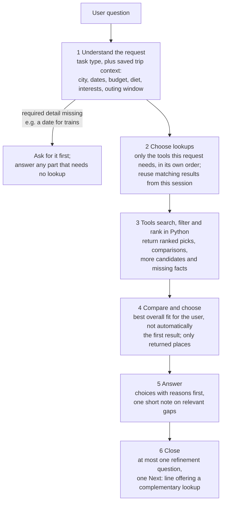
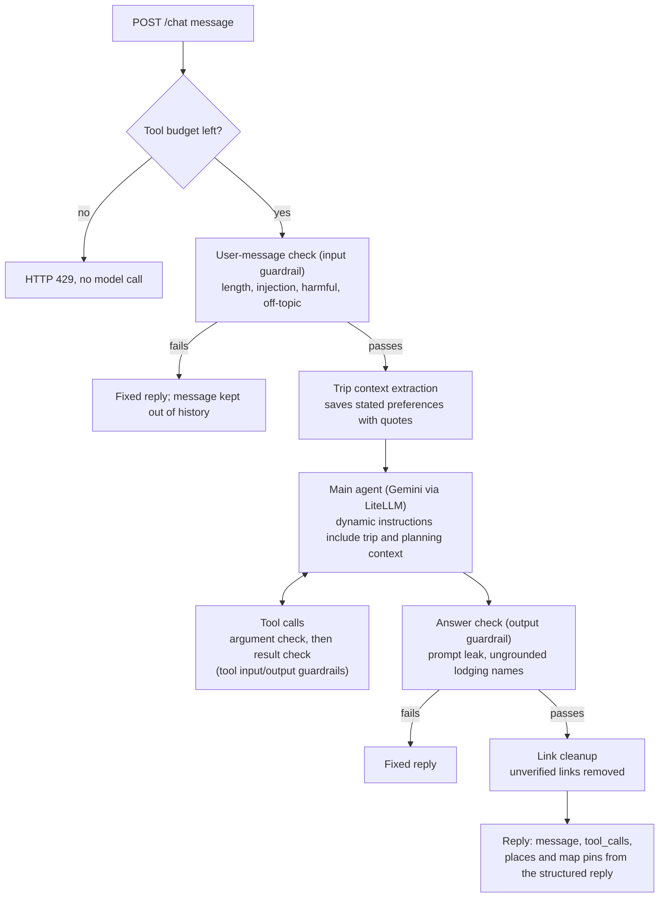
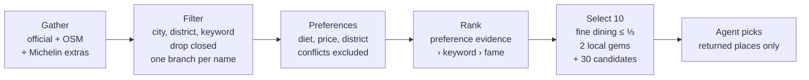
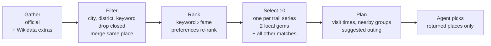

# Design notes

How [Taiwan Like a Local](../README.md) works: the agent's decision flow, each tool, the data
behind them, and how to run, test and deploy it. The README is the short version; this file is
the reference for contributors.

1. [Who needs what](#who-needs-what)
2. [Agent workflow](#agent-workflow)
3. [Agent design](#agent-design)
4. [Tools](#tools)
5. [Frontend](#frontend)
6. [Guardrails and limits](#guardrails-and-limits)
7. [Data](#data)
8. [Run locally and test](#run-locally-and-test)
9. [Deploy and access](#deploy-and-access)
10. [Project layout](#project-layout)

## Who needs what

| You want to | You need |
|---|---|
| Use the live app (browser or API) | A Google account that the team has authorized for the service ([Deploy and access](#deploy-and-access)). No API keys: the service holds its own. |
| Run your own copy | Your own TDX client ID/secret, CWA API key, and a GCP project with billing and the Vertex AI API enabled ([Run locally](#run-locally-and-test)) |
| Run the tests | Nothing: network and model calls are mocked |

Without Vertex AI there is no chat at all. Without TDX credentials, stays and trains fail;
sights and food still work from the daily open-data files. Without a CWA key, weather fails.

## Agent workflow

### Decision flow

How the agent turns a travel question into an answer. The rules come from
[prompts/system.txt](../prompts/system.txt); details are in [Agent design](#agent-design).



Typical combinations: a focused request uses one tool; a whole trip may combine a base
(stays), sights, food, transport, weather and crowds; a dated outing checks weather and, if
rain is likely, searches indoor sights separately.

### Request pipeline

What happens to one `/chat` message in the code ([app.py](../app.py),
[guardrails.py](../guardrails.py)):



At most 8 model turns per message. A turn has a 180-second deadline. Rejected or failed turns
roll back preference and choice changes.

## Agent design

### Conversation policy

Full rules: [prompts/system.txt](../prompts/system.txt). The essentials:

- **Answer first.** Broad requests get a few tool-backed picks with areas and reasons, then at
  most one optional question, asked only if it would improve the next answer. Details from the
  conversation are reused; ask before a lookup only when it needs a missing one (a date for
  trains). Skipped questions and corrections are respected.
- **Fit the task.** Suggestions or a comparison need not become an itinerary because a time budget
  is known. Rough budgets may use labeled assumptions, kept apart from returned prices.
- **Tools inform, the agent decides.** It may pick a different returned option for better overall
  fit. A district match is not a walking distance.
- **Useful over exhaustive.** Choices come first; status labels stay internal; gaps go into one
  short note. Missing fields never cause a refusal; strict filtering needs an explicit request for
  confirmed matches. This holds for every recommendation tool.
- **Close with Next:** one complementary lookup not yet covered, with a ready-to-type example
  (food → stays nearby; trains → crowds and weather that date; itinerary → weather, trains,
  crowds). Skipped when asking for details or when the user wants no questions.
- **Beyond the tools**, route advice may give estimated costs/durations, but exact last
  departures, current fares and all-night service need retrieved information. Source lines name
  only tool results, including reused ones; general knowledge is never shown as a lookup.

### Structured replies

The main agent returns SDK `output_type=TravelReply` (`agent_reply.py`): Markdown `message`,
proposed `places`, and lookup `sources`, as reference IDs carried by accepted planning records
and their candidates.

- The server resolves IDs within the session, ignores unknown references and places whose
  displayed labels are absent from the answer, and renders the source footer from the
  referenced results. General advice uses no sources.
- Internal IDs are removed from the displayed prose and labels; names, ordinary links and map
  references stay. Session history keeps the cleaned text.
- Attraction/food map pins use the referenced original listing names, so English-only answers and
  follow-ups that reuse earlier results get pins without another lookup.
- The frontend receives readable `response`, actual `tool_calls`, and `map_pins`; the JSON reply
  stays internal. Guardrails inspect the message; helper agents read its text. No additional
  model call is added.
- References identify returned records; they do not independently verify every sentence.

### Memory

Within one conversation (one `session_id`) the agent keeps three kinds of memory. **New trip**,
session eviction, six hours of inactivity or a server restart removes all three; none is a
permanent user profile.

| Memory | Holds | Limit | Code |
|---|---|---|---|
| Chat history | Messages and cleaned structured replies | Last 20 user turns | `app.py` |
| Trip context | What the **user said**: city, area, travel dates, departure point, budget, interests, dietary needs, outing duration/setting and clock window, question preference | Survives history trimming | `trip_context.py`, `prompts/trip_context.txt` |
| Planning context | What the **agent looked up and proposed**: candidate locations, reference prices, weather strategy, train times, suggested outing durations/timelines, proposals | 10 lookup records; archive of 80 for selected/proposed evidence; 9,000-character summary | `planning_context.py`, `agent_hooks.py` |

History is cut to 20 turns, but a stated need such as "vegetarian" must outlast it. And tool-ranked
picks, bounded assistant proposal excerpts and user-confirmed choices stay distinct; planning
facts never become user preferences.

**Trip context**

- Extracted after the input guardrail passes: one extra model call per accepted message
  (10-second timeout) with a typed SDK output. Dynamic instructions then include it.
- Each saved value carries an exact supporting quote from the current message. Evidence checks
  validate provenance and format; semantic extraction still depends on the model.
- Missing, explicit "no preference" and withdrawn details are distinct.
- Latest corrections replace old values. Changing city/date clears the old outing window;
  changing city also clears the area. Clock corrections reconcile the duration, and duration
  corrections derive a matching boundary. Derived values are marked; saved windows are restored
  only for the matching city/date. Unrelated preferences remain.
- Budgets keep the stated currency and scope; extraction does not convert prices.
- Explicitly named selections are saved with user evidence; vague agreement selects nothing.
- Invalid output or an extraction failure keeps the previous context; the conversation continues.

**Planning context**

- `agent_hooks.py` collects accepted tool results after output checks. Lookup keys include all
  executed criteria; candidate identities do not depend on lookup order.
- Proposals record each reply's recommended/alternative places and districts with a bounded text
  excerpt. Selected/proposed evidence survives ordinary lookup eviction in the archive.
- Before each main-agent call, dynamic instructions expose the relevant city's records, also on
  follow-ups after history trimming. The active city comes first; other destinations stay when
  space permits, so a side trip does not hide the accommodation base.
- Bounded conversation memory, not a stored itinerary; no extra model calls. Helper agents get
  the beginning and end of long replies, preserving the latest follow-up question.

**When a turn does not finish**

| Outcome | Trip context | Completed lookups | Proposals, named choices, reply |
|---|---|---|---|
| Completed | Updated | Updated | Updated |
| Rejected by the input or output guardrail | Rolled back | Rolled back | Rolled back |
| Model/provider error, HTTP 429, timeout, or tool-round limit | Rolled back | **Kept** | Rolled back |

A rejected message is also kept out of history. HTTP 429 from the provider stops the turn early
with a busy message instead of more model calls. Kept lookups are shown even without a final
answer.

**Sessions.** Requests within a session run in order, so updates never overlap; New trip cancels
the active turn before removing its state, and busy sessions are never evicted. After a refresh
the browser restores its bounded transcript and board while the session is active, and says
when it has expired. Deadlines: classifier/extractor 10 seconds, turn 180, frontend request 190.

### Diagnostics

Each turn saves a diagnostic entry (last 20 turns) and logs `Agent planning diagnostics`:
main-agent model calls, tool counts, recommended places by kind, failed lookups, elapsed time,
and flags for broad plans missing sightseeing/food results, identical repeated lookups, and food
searches without a planning area. Logs omit chat text, arguments and results. Flags are review
signals, not proof of a bad answer, and there is no fixed daily stop count (slow visits and
travel days need fewer). Hooks never force tool choices or rewrite answers.

### SDK tools

- The main agent uses `gemini-3.5-flash-lite` on Vertex AI with medium thinking
  (`ModelSettings.reasoning` in `app.py`); the input classifier and preference extractor use
  minimal thinking to stay fast.
- All seven tools are typed `@function_tool` wrappers in `tools/agent_tools.py`. The SDK builds
  descriptions and JSON schemas from type hints and Google-style docstrings: `Literal` for
  choices, `Annotated`/Pydantic `Field` for numeric bounds. There are no handwritten `SCHEMA`
  dictionaries; the plain functions and `run_tool` registry stay usable by tests and scripts.
- The shared adapter runs synchronous work in a worker thread, restores saved outing arguments,
  applies explicit lodging counts, and records actual arguments/results for the chat display.
  Input/output tool guardrails still run. SDK argument errors return recorded `error`/`hint`
  replies so the agent can correct the call. With `strict_mode=False` for Gemini, optional
  arguments keep defaults; supplied values are validated and unknown arguments rejected.
- The adapter adds conditional `next_steps` hints for broad trip plans and dated single-day
  outings lacking matching weather. They never execute tools or save preferences; same-turn
  attempts suppress repeats, and matching earlier weather can be reused. The trip-plan detector
  is heuristic. Conversation policy and the weather/attraction combination stay in the prompt.
- To add a tool: register its function in `tools/__init__.py`, add a typed wrapper to
  `build_tools` with a docstring for its arguments, extend the mocked tests, and check a fresh
  app session ([manual checks](#manual-checks)).

## Tools

| Tool | What it does | Data source |
|---|---|---|
| `legal_stay_check` ⭐ | Checks registration, or recommends registered stays by district, type and reported starting rates | Tourism Administration lodging register via [TDX](https://tdx.transportdata.tw/) |
| `find_local_food` | Restaurants by dish, diet and price, ranked by preference evidence, then awards/local score; night markets; `style: local` | Tourism Administration [daily open data](https://data.gov.tw/dataset/7779) (TDX as fallback), [OpenStreetMap](https://www.openstreetmap.org/copyright), award lists, local night-market schedules |
| `find_attractions` | Sights by interests, indoor/outdoor setting and available time, with a ranked pick, alternatives and a suggested outing; `style: local` | Tourism Administration [daily open data](https://data.gov.tw/dataset/7777) (TDX as fallback), plus [Wikidata](https://www.wikidata.org/) and Wikipedia pageviews for fame and missing sights |
| `hsr_trip_planner` | THSR or TRA options ranked by time/fare preferences; default three, up to ten | TDX rail timetables and adult one-way standard-class fares |
| `typhoon_backup_plan` ⭐ | Compares forecast periods for the outing window and recommends outdoor, flexible or indoor plans | [CWA open data](https://opendata.cwa.gov.tw/) (`F-D0047-091`, `W-C0034-001`) |
| `crowd_risk_check` ⭐ | Official days off and travel-pressure estimates for trips up to 30 days | [Government office calendar](https://data.gov.tw/dataset/14718) and [historical TRA station entries](https://data.gov.tw/dataset/8792) |
| `twd_exchange` | Converts to/from TWD and compares weekly samples over four weeks | [fawazahmed0/exchange-api](https://github.com/fawazahmed0/exchange-api) daily rates |

⭐ = original tool. Every tool returns `{"error", "hint"}` on failure so the model knows what to do
next. Missing facts are **unknown**, explicit contrary reports **conflicts**, failed lookups
**unavailable**; source claims are **reported**, not independently verified. Food, attractions,
lodging, rail and weather return explicit comparison fields.

### Lodging (`legal_stay_check`)

- **Check mode:** a unique normalized same-city name gives `match_status: matched`,
  `is_registered: true`; similar or out-of-city records come back as `candidates` (null), with
  addresses to tell them apart. Name matching falls back nationwide. No match does not prove a
  stay illegal.
- **List mode:** `district` (Traditional Chinese), `type` (`hotel`/`bnb`), `price_preference`
  (`budget`/`any`), and `max_price_twd` for a stated nightly budget. "Cheap" means `budget`,
  which ranks by lower reported starting rates without inventing a cap. One cached TDX query
  fetches up to 500 candidates; Python filters, deduplicates and ranks them and returns up to
  `limit` (1–10, default 5). A pool reaching 500 may be incomplete.
- **Count:** an explicit recommendation count is applied by the SDK wrapper even if the model
  omits `limit`; guests, nights, star ratings and prices are not counts.
- **Ranking:** a numeric budget excludes known higher starting rates; absent/zero/invalid rates
  stay unknown and eligible. For budget requests known lower rates come before missing ones,
  and certification breaks price ties. Without a price preference, Taiwan Host certification
  leads.
- **Results:** `stays` (map fields plus `district`, `price_range_twd`, `preference_match`) and
  `comparison` (recommended name, reasons, reference-price differences, candidate counts).

| Can compare | Limits |
|---|---|
| Registration, licensed type, district, certification, structured reference rates, ranked pick and trade-offs | Registration is not a quality rating. Prices are owner-reported reference ranges, not booking quotes: a starting rate within a cap does not mean every room or date qualifies, and missing rates still allow suggestions. A district match does not mean near a landmark or MRT. No live rooms |

### Food (`find_local_food`)



- **Gather:** official restaurants (daily file), OSM places and Michelin extras. An OSM place
  within 150 m of an official one with a matching name is merged into it. `names` skips the
  search and looks names up loosely (阿宗麵線 finds 阿宗麵線西門店), listing misses in
  `not_found`; keyword `night market` returns registered markets plus rotating-market days.
- **Filter:** keyword matches the Chinese name, English name or OSM cuisine tag.
- **Scores** ([scripts/build_food_fame.py](../scripts/build_food_fame.py)):
  - Fame is the strongest signal: Michelin 3 stars 1.0, 2 stars 0.95, 1 star 0.9, Bib Gourmand
    0.75, Selected 0.6; 500盤/500碗 by plates or bowls on a log scale; 0.7 for a reviewed
    well-known place without awards; 0.2 for an OSM English name alone.
  - Local is max(500盤, 500碗) × (1 − Michelin score); chains (a name on 5+ OSM places) get 0.3
    of it. Awards last listed in 2024 count 0.7, earlier ones 0.5. `style: local` ranks by it.
  - Fine dining is a Michelin star, $$$ or higher, or a 500盤 place that neither 500碗 nor a
    Michelin $–$$ price marks as everyday food. Unless asked for (Michelin, omakase, tasting
    menu…), it fills at most a third of the results.
  - A manual closed list (e.g. RAW) removes places the data still lists.
- **Preferences:** `dietary` (`vegetarian`/`vegan`), `price_preference`
  (`budget`/`mid_range`/`any`), `max_price_twd` (per person per meal, TWD) and `confirmed_only`;
  keep them on `names` lookups. `budget` selects `$`, `mid_range` allows `$`/`$$`; unknown bands
  stay unconfirmed, and no band verifies an exact cap (lower known bands just rank first).
  `confirmed_only` (only on request) needs reported support for every criterion, not live
  verification.
- **Comparison:** each result's `facts` hold `value`, `status` and `source` (plus dietary
  evidence); `comparison` marks fit as `reported_match`, `needs_confirmation`, `conflict` or
  `not_requested`. Conflicts go to `excluded`; with `confirmed_only`, unconfirmed candidates are
  excluded too, without names, and exact meal caps cannot be confirmed yet.
  `comparison_summary` counts matches, leads and both kinds of exclusions.
- **Ranking:** dietary reports, then dietary name/cuisine indications, then no dietary evidence;
  then other criteria, dietary variety, relative prices, keyword and awards. Searches
  constrained by district, diet or price add no local gems and no fine-dining cap. Searches are
  not exhaustive; ordinary suggestions can offer dietary leads with a brief caveat, and "cheap"
  needs no exact price confirmation.
- **Dietary data:** OSM keeps [vegetarian](https://wiki.openstreetmap.org/wiki/Key:diet:vegetarian)
  and [vegan](https://wiki.openstreetmap.org/wiki/Key:diet:vegan) distinct; names/cuisine are
  only indications and contradictory tags stay uncertain. The bundled file (built 2026-10-02)
  predates dietary tags in the builder, so its records count as unknown until the next rebuild.
  Merged listings keep the source of borrowed hours/dietary information.
- **Results:** name, English name, awards, `known_for`, relative `price` band, address, hours,
  `facts`, `missing_fields` and a Google Maps link from the coordinates. Results carry no
  coordinates; pins come from the final reply.

| Can compare | Limits |
|---|---|
| Dietary reports, cuisine, district, relative price band, awards, listed hours | No exact current menu prices or ingredient guarantees; some districts are estimated; 57% of OSM places have no street address |

### Attractions (`find_attractions`)



- **Gather:** official listings (daily file) and Wikidata extras. `names` skips the search and
  looks names up loosely (士林夜市 finds 士林觀光夜市), reporting closed and unmatched names.
- **Filter:** keyword in name or description (`nature` matches by category instead); listings
  whose names contain each other are merged.
- **Scores** ([scripts/build_fame.py](../scripts/build_fame.py)): fame is the mean of each
  listing's county percentiles for Chinese Wikipedia views, article length and language
  editions, halved for campuses, stations, airports and science parks; a trail matched to its
  mountain scores by the mountain's English Wikipedia views. Local fame is fame × (1 − English
  fame); 226 local favorites were labeled by Qwen and reviewed by a second model.
- **Select:** without preferences, the last two slots go to local gems (reviewed favorites or
  local fame of 0.8+); `style: local` ranks by favorites, then local fame, with temples capped
  at a third. `more_candidates` lists every other match by district.
- **Preferences:** `interests` (history, art, nature, hiking, shopping, culture, museums,
  temples), `setting` (`indoor`, `outdoor`, `any`) and `available_minutes` (15–720, the whole
  outing excluding travel to/from the area); keep them on `names` lookups. They rank before
  fame/local scores without excluding unknown or partial matches. Time and setting persist in the
  session (the wrapper restores them on follow-ups); a destination change clears the time budget.
- **Planning:** each result has `planning` and `preference_match`; `comparison` gives the
  recommended name, reasons, alternatives and nearby groups (every pair within 2 km in a straight
  line). A time-budgeted `suggested_visit` is an ordered `timeline`: visits limited by time and
  suitable candidates, estimated city transfers (20–60 minutes, 45 when coordinates are unknown,
  possibly beyond the nearby radius), and a 30-minute break for outings of four hours or more
  with several stops. Visits use typical category durations rather than stretching to fill the
  budget; planned and remaining minutes are reported. For an itinerary the agent fills remaining
  time with suitable options, another search, or explicit free time; the candidate limit is not a
  quota of stops.

| Can compare | Limits |
|---|---|
| Categories, listed details, interest/setting fit, estimated visit duration, ranked comparison and nearby outing | Durations and indoor/outdoor labels are category/name estimates; distances are not walking routes; the outing is not checked against opening hours. Hours/fees can be missing but still allow recommendations |

### Rail (`hsr_trip_planner`)

- Ranks the whole matching timetable, then returns `limit` options (1–10, default 3); each query
  covers one rail service, using the same station, timetable and fare requests (none per train).
- `preference`: `earliest_arrival` (default; ties favor shorter journeys), `fastest`, `cheapest`
  (adult standard-class fares, ties favor shorter journeys; unknown fares are never free), or
  `earliest_departure` (only when requested).
- `depart_after`/`depart_before` form an inclusive `HH:MM` departure window; `arrive_by` is an
  inclusive deadline on the **same travel date**. Overnight journeys include `arrival_date`, and
  arrival ranking accounts for the day change.
- Results: `trains` (types, times, durations, fares) and `comparison` (recommended train, reason,
  matching/returned counts, equal-fare flag, time/fare differences). Missing fares leave schedules
  usable; `cheapest` with no fares recommends the earliest arrival. Station/timetable failures
  return errors.

| Can compare | Limits |
|---|---|
| Train type/number, departure, arrival/date, duration, fare, time windows, ranked recommendation and trade-offs | Up to ten options per query within one rail service; no live seats/delays; fares can be missing |

### Weather (`typhoon_backup_plan`)

- **Window:** `available_minutes` (15–720) and same-day `start_time`/`end_time` in Taiwan
  `HH:MM`; default 08:00–20:00, and a start plus duration supplies the end. The session keeps the
  duration and window on follow-ups; train windows are not sightseeing windows.
- **Assessment:** `forecast` keeps the daily summary; `comparison` uses only intervals overlapping
  the outing (including overnight periods from the previous day), aligned by timestamp. Rain
  below 40% favors outdoors, 40–69% flexible, 70%+ indoors: app heuristics, not CWA warning
  levels or rainfall intensity. Periods can split the plan; missing values and incomplete
  coverage never become an all-clear. Per the [CWA product specification](https://opendata.cwa.gov.tw/opendatadoc/Forecast/F-D0047-001_093.pdf)
  weekly intervals are 12 hours with rain probabilities only for the first three days; the tool
  invents no hourly probabilities.
- **No places:** the tool makes no attraction or TDX lookup. When useful, the agent calls
  `find_attractions` separately (known district, interests, indoor setting for a rainy backup,
  `comparison.available_minutes` capped to the window); both calls show in `/chat.tool_calls`.
  Weather-only requests can stop after the weather call, and earlier attraction results can be
  reused. An indoor outing is an alternative for the window, not extra stops. A failed
  attraction lookup leaves the weather result available; the legacy `backup_spots` field stays
  empty.
- **Warnings:** current warnings are separate from future-date forecasts. A warning covering
  today's city sets `postpone_outing` ([CWA typhoon precautions](https://www.cwa.gov.tw/V8/C/K/Encyclopedia/typhoon/typhoon.pdf)).
  An unavailable warning feed is not "no warning". Dates beyond the forecast get a seasonal
  note; gaps within it are reported as missing forecasts.

| Can compare | Limits |
|---|---|
| Time-window comparison, rain chance, temperature, current warning, activity strategy | Forecast periods are broad, not hourly; rain probabilities can be absent; warnings are current; place searches are separate |

### Crowds (`crowd_risk_check`)

Compares day types with 2026 TRA station-entry counts through September 1. The
[calibration script](../scripts/calibrate_crowd_risk.py) divides each date's total entries by the
median of ordinary same-weekday days within 56 days; a high rating needs at least five sampled
days and a median ratio of 1.2 or more. Pre-break days meet it; first and last days of long
breaks do not. The [compact calibration](../tools/data/crowd_calibration.json) is bundled, so
lookups only download the annual calendar; refresh it with
`uv run python scripts/calibrate_crowd_risk.py`.

| Can compare | Limits |
|---|---|
| Holiday pattern, estimated risk/reason, historical ratio and sample size | Preliminary TRA network estimate (a network-wide proxy), not route occupancy, HSR demand or a route-specific forecast |

### Exchange (`twd_exchange`)

Compares today with available 7/14/21/28-day snapshots, not 30 daily rates (`sampled_average`,
`comparison_method`, `comparison_status`; legacy `avg_30d`/`vs_30d` remain). Without historical
samples the conversion is still returned, with a null average/difference and comparison
unavailable.

| Can compare | Limits |
|---|---|
| Rate, rate date, converted amount, sampled historical comparison | Mid-market snapshot; no actual cash-counter quote or travel prices; average uses weekly samples |

## Frontend

### Trip notes panel

Every tool has a panel card: Stays, Food, Sights, Dates, Trains, Weather and Money. Food and
Sights list up to six returned places with English names and districts, the answer's picks first
(marked Suggested), plus rotating night-market days. Answers from general knowledge, rejected
messages and refused (budget-exhausted) turns make no lookup, so they add nothing to the panel.
Board results are scoped by route/date/location, including failed and empty searches. Different
journey legs and weather days can coexist. Proposed pins use stable IDs, English reply labels,
and recommended/alternative roles; changed proposals replace earlier pins for that city/category.

### Map

Only places named in the answer are pinned: search results carry no coordinates, and `map_pins`
comes from the structured reply's places. The Leaflet map uses
[OpenFreeMap](https://openfreemap.org/quick_start/) vector tiles through MapLibre GL, labelled
with English names, then romanized names (`name_int`, `name:latin`); places with neither stay
unlabeled rather than showing Chinese. No additional API key is needed. A label-free
[Esri Light Gray](https://www.arcgis.com/home/item.html?id=ed712cb1db3e4bae9e85329040fb9a49)
raster map appears immediately while vector assets load asynchronously, so map downloads do not
block chat. `index.html` preloads the MapLibre scripts and style in parallel. A 30-second
deadline covers only those downloads; once the vector map is added it is kept however long its
tiles take, and it replaces the label-free map when it has drawn. Single tile or font errors are
not fatal. Only a failed download or missing WebGL keeps the label-free map, with a short note
under it; otherwise no note is shown. Map/CDN requests go to their public providers.

### English labels

The panel shows English only: tools add `holiday_name_en` and `weather_en`, and lodging fills
`name_en` (and `run_tool` adds `name_en`/`district_en` to every listed place) with `english_name`
([tools/english_labels.py](../tools/english_labels.py)), which translates common words
(民宿 → B&B, 牛肉湯 → Beef Soup, 花蓮 → Hualien) and romanizes the rest in Hanyu Pinyin. Map pins
use the answer's label when it is English, otherwise the romanized listing name. City names and
licence numbers are rendered in English and Chinese glosses are dropped. Only the raw lookup
details under **details** still contain Chinese.

## Guardrails and limits

### Guardrails

The agent runs on the [OpenAI Agents SDK](https://openai.github.io/openai-agents-python/guardrails/)
with Gemini through its LiteLLM adapter (beta). Guardrails use the SDK's interfaces, in
[guardrails.py](../guardrails.py):

| Checks | Rule | When it fails |
|---|---|---|
| The user's message (input guardrail, blocking, before the model) | Message over 2,000 characters; a Gemini classifier (safety filter off, so it can read what it labels) flags prompt injection, harmful requests, or requests outside Taiwan travel | Tripwire: fixed reply, no main model or TDX call, message kept out of history. A classifier error allows the message |
| The model's tool arguments (tool input guardrail) | Any string argument over 200 characters | Rejected: the model gets an error and hint instead of a tool run |
| The tool's result (tool output guardrail) | Result text that looks like instructions (e.g. "ignore previous instructions") | Rejected: the model gets an error and hint; the result is hidden from the trip notes |
| The agent's answer (output guardrail) | Answer repeats a system-prompt sentence, or names a Chinese lodging (in parentheses) that no tool result or user message contains | Tripwire: fixed reply |
| The answer's links (cleanup after the run) | Links to a host that is not official (`.gov.tw`, `taiwan.net.tw`, `thsrc.com.tw`, `transportdata.tw`) and not in a tool result or user message | The link is removed (Markdown links keep their text) and the rest of the answer is shown; history keeps the cleaned answer |
| The model (Gemini safety settings) | Block medium-or-higher harassment, hate, sexual, and dangerous content | Fixed reply |
| The agent loop | At most 8 model turns; model errors are logged, not shown | Fixed reply |

Each tool still validates its own arguments. SDK tracing is off, so chats are not sent to
OpenAI. Not covered: per-user rate limiting, PII, lodging names written only in English (the
register lists Chinese names only).

### Lookup budget

All users share a budget of 5 tool calls per rolling minute (`TOOL_CALLS_PER_MINUTE` overrides
it), set in [tools/call_budget.py](../tools/call_budget.py). Each call frees its slot 60 seconds
after it ran. Over the limit, a tool returns an `error` with `retry_after_seconds`, and `/chat`
answers HTTP 429 without calling the model. `GET /quota` and each `/chat` reply's `tool_quota`
give `limit`, `remaining`, and `frees_in_seconds`; the header meter shows "3 of 5 available ·
1 renews in 14 s" and disables sending while no lookup is free. It is a rolling window rather
than a reset every clock minute, so no 60-second span ever exceeds five calls.

### Sessions and timeouts

Sessions keep the last 20 user turns, with at most 200 sessions in memory and six hours of
inactivity before expiry. Classifier/extractor calls have ten-second deadlines, a turn has a
180-second deadline, and the frontend request stops after 190 seconds.

## Data

### Daily open-data files

Attractions and restaurants come from the Tourism Administration's daily open-data files
([tools/tourism_data.py](../tools/tourism_data.py)). They hold every listing, with no TDX quota
and no 500-row cap per query; until they load, or if the download fails, the tools query TDX.
Each file is a full snapshot that replaces the previous day's copy; a failed download keeps
the previous copy.

- At startup a background thread downloads them (the attractions file takes up to 90 seconds).
- Each download is saved to `data/daily/` (git-ignored; `TOURISM_CACHE_DIR` moves it), so a
  restart within a day reads the saved zip in about 0.1 seconds instead of downloading again.
  A day-old copy is used while a new one downloads; an unreadable copy is ignored.
- Cloud Run instances start from the image, so a cold start still downloads.
- Hotels stay on TDX: their file is too large for a 512 MiB instance.

Data is used under the [Open Government Data License, version 1.0](https://data.gov.tw/license).

### Data freshness

Tool results include `data_freshness` entries with source, UTC retrieval time, age, and stale
status. TDX and daily tourism caches can retain useful older data during outages; stale board
cards show retrieval time. Forecast fallback is limited to two hours, and warning fallback to
15 minutes; fresh warning cache lasts five minutes. Old session weather is marked for refresh.

### Ranking data

Official listings carry no popularity signal, so the bundled files in `tools/data/` add one.
Each has a build script; none is needed at runtime. They are rebuilt by hand, not daily.

| File | Built by | What it holds | Sources and terms |
|---|---|---|---|
| `attraction_fame.json` | [scripts/build_fame.py](../scripts/build_fame.py) | Fame (Chinese Wikipedia views, article length, languages, per county), English fame (English Wikipedia views), and local fame (known in Chinese, little read in English) | Wikidata (CC0), Wikimedia pageviews |
| `extra_attractions.json` | same | 1,376 sights the register lacks (駁二, 花園夜市), not closed | Wikidata (CC0) |
| `local_favorites.json` | [scripts/label_local_favorites.py](../scripts/label_local_favorites.py) | 226 places labeled as where locals go: Qwen labels, then a second review ([data/local_review.csv](../data/local_review.csv)) | Model labels |
| `osm_food.json.gz` | [scripts/build_osm_food.py](../scripts/build_osm_food.py) | 48,485 restaurants, cafes and stalls; street address for 43%, district estimated from the nearest official listing for 97% | © OpenStreetMap contributors, [ODbL 1.0](https://www.openstreetmap.org/copyright) |
| `food_fame.json` | [scripts/build_food_fame.py](../scripts/build_food_fame.py) | Food fame and local score, awards per place, and 371 Michelin restaurants OSM lacks | Michelin Guide Taiwan via [michelin-my-maps](https://github.com/ngshiheng/michelin-my-maps); 500盤 and 500碗 lists by 500輯 (udn), in `data/food_awards/` |
| `data/food_awards/known_food.json` | [scripts/list_known_food.py](../scripts/list_known_food.py) | 99 well-known places without awards: listed by Gemini, checked against OSM, reviewed ([data/known_food_review.csv](../data/known_food_review.csv)) | Model list |

**Research and education use only.** This is a course project. The Michelin Guide data
(michelin-my-maps states its data is for research use only) and the 500盤/500碗 lists (© 500輯)
are used for research and education, not commercially, and are not redistributed for other use.
Remove `food_fame.json` and `data/food_awards/` before any commercial use; the food tool then
ranks by OpenStreetMap order.

To refresh food data: `uv run python scripts/build_osm_food.py` (15–40 minutes; Overpass is
slow), then `uv run python scripts/build_food_fame.py` (about 1 minute) so awards match the new
places.

## Run locally and test

### Setup

Install [uv](https://docs.astral.sh/uv/getting-started/installation/) and run these commands
from the repository root after cloning or pulling this branch:

```bash
uv sync --locked --group dev
cp .env.example .env
```

The tracked `.python-version` selects Python 3.13, which Cloud Run's buildpacks support. `uv`
creates `.venv` and installs the versions in the tracked `uv.lock`, downloading Python if needed.
No activation or separate `pip install` is required. Copy the template only on first setup; keep
an existing `.env`.

Fill **`.env`**, not `.env.example`, with your own `TDX_CLIENT_ID`, `TDX_CLIENT_SECRET`,
and `CWA_API_KEY`. Obtain them from [TDX](https://tdx.transportdata.tw/) and
[CWA open data](https://opendata.cwa.gov.tw/). `.env` and `.venv` are ignored by Git.

For model calls, install the Google Cloud CLI, select a GCP project with billing and the
Vertex AI API enabled, and configure your own application default credentials:

```bash
gcloud config set project YOUR_PROJECT_ID
gcloud auth application-default login
uv run app.py
```

Open http://localhost:8000. Gemini runs on Vertex AI through LiteLLM; no OpenAI API key
is needed. Building the environment does not require API credentials; live chat and
data lookups require the relevant credentials above.

### Tests

```bash
uv run pytest -q
```

Tests use mocked network/model calls. Install Node.js 22+ to include the frontend checks; pytest
skips that check if Node is absent. CI installs Node and runs both Python and frontend checks.
After pulling dependency changes, rerun `uv sync --locked --group dev` rather than copying another
contributor's `.venv`.

Automated comparison tests use competing fictional candidates. Mocked and scripted-model tests
establish harness, hook, state and ranking behavior. They do
not establish whether Gemini follows the policy or chooses the right tools: after changing a
prompt, a tool description or a docstring, restart the app and run the manual checks below,
inspecting the displayed tool calls as well as the answer.

### Manual checks

Example queries:

1. `I have $1,500 USD for a week. How much is that in TWD, and find me registered B&Bs in Tainan under 3,000 TWD a night.`
   → `twd_exchange` (with a four-week sampled comparison), then `legal_stay_check` with a price cap.
   Follow-up to test memory: `Is the second one you listed registered? Double check it.`
2. `Recommend me mountain trails in Taipei.` then `Which one is best for sunset? Are there any temples near it?`
   → `find_attractions` for trails, then again with a district for nearby temples. Only the places named in the answer are pinned.
3. `I'm going to Hualien this Saturday. Any typhoon or rain I should worry about?`
   → `typhoon_backup_plan` checks the CWA forecast and typhoon warnings. The agent can then call
   `find_attractions` for useful indoor alternatives; each lookup appears separately in the chat.

Conversation policy:

- `Give me some food recommendations in Taipei.` → recommendations first, then an optional refinement.
  Follow with `Around Ximen, and vegetarian.` → uses Taipei and the new preferences; does not ask for the city again.
- In a new trip, `Recommend sights in Taipei. Just give me three options, no questions.`
  → three tool-backed suggestions without a refinement question.
- In a new trip, `Find a train from Taipei to Tainan.` → asks for the travel date before a timetable lookup.
- In a new trip, `Help me plan a cheap weekend in Taipei.` → a base, sightseeing and food
  covering the requested duration, with nearby sights/meal ideas and low-cost reasons,
  followed by one useful refinement question. A weekend normally gets two day sections;
  `Plan a cheap week in Taipei.` gets seven. Dates become day labels, while short outings
  use the computed timeline. Stop counts adapt to pace, long visits, transfers and partial days.
- After a stay/sightseeing plan, `I'll follow your plan. What about food?` → searches food in
  the plan's area and explains how it fits. If multiple bases were offered, it states a provisional
  choice; assistant suggestions remain separate from user-stated preferences.
- After the Taipei/Ximen food conversation, `Actually, Tainan. Keep it vegetarian, no questions.`
  → uses Tainan, drops Ximen, retains vegetarian, and skips optional refinement questions.
  Click **New trip**, then ask for food without a city → asks for a city rather than reusing Tainan.

Planning continuity: ask for a weekend stay/outing, then `Sounds good. What about food?`. Also
select a returned hotel by name and ask for nearby sights.

Food preferences: in a fresh trip, `Recommend vegetarian food around Ximen in Taipei. I prefer cheap places.`
Then `What about vegan options under TWD 300 per person per meal?` Inspect dietary/price
arguments and checks: the agent should explain its choice and alternatives, and disclose
unconfirmed dietary evidence and exact prices. Missing results must not become invented
recommendations.

Trains: `Find three HSR options from Taipei to Tainan on October 8, 2026. Depart between 09:00 and
12:00 and arrive by 14:00. Prefer the fastest journey. Which would you choose?`
Then: `Keep the same route and date, but show five options and prioritize the earliest arrival.`

## Deploy and access

Cloud Run with continuous deploy from GitHub (`Procfile`: `web: python app.py`). Set
`TDX_CLIENT_ID`, `TDX_CLIENT_SECRET`, and `CWA_API_KEY` as environment variables on the service.
Keep max instances at 1: sessions are stored in memory, so another instance would not see them,
and a redeploy clears them.

**Access is limited to authorized users.** The service sits behind Identity-Aware Proxy (IAP):
an unauthenticated request is redirected to Google sign-in, and only Google accounts granted the
**IAP-secured Web App User** role (`roles/iap.httpsResourceAccessor`) can use the app or its API.
Any Google account, group or domain can be granted; project roles such as Owner do not
necessarily include it. To add someone: Google Cloud console → **Security → Identity-Aware
Proxy** → select the Cloud Run service → **Add principal** → that role.

API for authorized callers:

| Endpoint | Use |
|---|---|
| `POST /chat` | Body `{"message": "...", "session_id": "optional"}`; returns `response`, `session_id`, `tool_calls`, `map_pins`, `places`, `tool_quota` |
| `GET /quota` | Lookup budget left |
| `GET /session/{session_id}` | Whether a session is still active |
| `POST /clear?session_id=...` | End a session |

A program calls through IAP with an OpenID Connect ID token for an authorized principal, usually
a service account, in `Authorization: Bearer <token>`. Before opening the service further, note
that the lookup budget and the Vertex AI cost are shared by every user, and that CORS is not
configured (browser pages on other sites cannot call the API directly).

## Project layout

```
app.py              routes, session store, Agents SDK agent and tools, sight pins
agent_reply.py      typed final replies, validated place/source references, source rendering
agent_hooks.py      SDK hooks: session planning facts and per-turn diagnostics
planning_context.py bounded planning records and explicitly selected candidates
trip_context.py     validated user preference updates, separate from bounded chat history
guardrails.py       input, output, and tool guardrails
prompts/system.txt  system prompt (with {today} filled in on each turn)
prompts/trip_context.txt  rules for extracting user-stated trip preferences
tools/__init__.py   plain Python tool registry (TOOL_MAP + run_tool)
tools/agent_tools.py typed @function_tool wrappers, generated schemas and execution adapter
tools/call_budget.py shared tool-call budget (5 per rolling minute)
tools/planning_hints.py conditional next_steps suggestions for broad plans
tools/freshness.py  per-tool data ages for data_freshness
tools/english_labels.py English labels for calendar notes and CWA weather text
tools/tdx_client.py TDX token, caching, rate-limit handling, city names
tools/gov_tls.py    HTTP sessions for government sites with strict-TLS certificate issues
tools/tourism_data.py daily open-data files for attractions and restaurants, saved to data/daily/
tools/lodging.py    legal_stay_check
tools/lodging_preferences.py stay comparisons from reported reference prices
tools/food.py       find_local_food
tools/food_preferences.py  sourced food facts and deterministic preference comparisons
tools/attractions.py find_attractions (and pins for the places an answer recommends)
tools/attraction_preferences.py interest/setting fit, visit estimates, nearby groups, outings
tools/exchange.py   twd_exchange
tools/transport.py  hsr_trip_planner (THSR and TRA)
tools/holidays.py   crowd_risk_check (official calendar, estimated travel pressure)
tools/weather.py    typhoon_backup_plan (CWA forecast and typhoon warnings)
tools/weather_planning.py outing strategy from forecast intervals
scripts/            builds for the bundled data (fame, extra sights, local favorites, OSM food,
                    food awards, well-known food, crowd calibration)
data/               source lists for builds (food awards, reviews); data/daily/ holds the daily files
static/             frontend (questions and answers, lookup list, Leaflet map, trip notes, lookup meter)
tests/              tool, harness, and guardrail tests
.github/workflows/  CI: pytest and frontend checks
```
